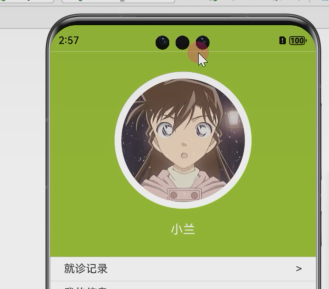

## 简单的实现一些页面效果


```ts
const img: image[] = [
  {
    id: '1001',
    name: '三月七',
    image: '/images/sanyueqi.jpg',
    text: '她是一位被冰埋藏很久的少女，在三月七日被星穹列车搭救， [57]为了寻找身世的真相，三月七选择与星穹列车同行，并使用自己登上星穹列车的三月七日为自己命名。'
  },
  {
    id: '1002',
    name: '芙利莲',
    image: '/images/FuLiLian.jpg',
    text: '打倒魔王的勇者一行的魔法使，长寿的精灵族，人类族大魔法使伏拉梅的徒弟，名字源于德语，意为“冰冻”。芙莉莲在小时候所居住的村子被魔族屠村，而她在杀死魔族将军后为大魔法使伏拉梅所救，并成为了伏拉梅的徒弟'
  },
  {
    id: '1003',
    name: '理之律者',
    image: '/images/LiLv.jpg',
    text: '理之律者是简单易上手的冰元素输出角色，近距离积攒构造能量后，可蓄力连续打出远程高额伤害，必杀技会进入骑乘模式，造成大量伤害'
  },
  {
    id: '1004',
    name: '人之律者',
    image: '/images/renlv.png',
    text: '凡事任凭心意而为，自由自在，与副首领身份格格不入的少女。亦是逐火英桀的创立者，聚集并维系此十三人的核心人物。只在喜欢的人上花时间，但每个人都很喜欢；只在有趣的事上花心思，但每件事都很有趣——心怀如此信念，带着真诚与热情拥抱每一天的纯真女孩'
  },
  {
    id: '1005',
    name: '洛天依',
    image: '/images/TianYi.png}',
    text: '天依作为首个中文虚拟歌手，为中国虚拟IP技术奠基了发展方向以及创作内容，作为中国第一位虚拟歌手，她有着可爱甜美的少女形象，加上治愈的声音和极具感染力的舞姿，颇受年轻人的喜爱'
  }]

interface image {
  id: string;
  name: string;
  image: string;
  text: string
}

@Entry
@Component
struct ShowPage {
  @State imgIndex: number = 0;

  build() {
    Column() {
      Image(img[this.imgIndex].image)
        .width('100%')
        .height('100%')
        .expandSafeArea([SafeAreaType.SYSTEM], [SafeAreaEdge.TOP])
      Column() {
        Row()
          .width(70)
          .height(2)
          .backgroundColor('#c9999999')


        Row()
        Swiper() {
          Column() {
            Text(img[this.imgIndex].name)
            Text(img[this.imgIndex].text)
          }
          Column() {
            Text(img[this.imgIndex].name)
            Text(img[this.imgIndex].text)
          }
          Column() {
            Text(img[this.imgIndex].name)
            Text(img[this.imgIndex].text)
          }
          Column() {
            Text(img[this.imgIndex].name)
            Text(img[this.imgIndex].text)
          }
          Column() {
            Text(img[this.imgIndex].name)
            Text(img[this.imgIndex].text)
          }
        }
        .autoPlay(true)
        .onChange((index)=>{
          this.imgIndex=index
        })
        .indicator(Indicator.dot())
        .width('100%')
        .height(150)
        .padding(12)
        Text('跳过')
        Button('下一步')
          .width('80%')
          .margin({top:12})
      }
      .width('100%')
      .height('35%')
      .backgroundColor('#fff')
      .position({
        bottom: 0
      })
      .expandSafeArea([SafeAreaType.SYSTEM], [SafeAreaEdge.BOTTOM])
      .borderRadius({
        topLeft: 20,
        topRight: 20
      })
      .padding(12)
    }
    .height('100%')
    .width('100%')
  }
}
```


## 制作一个广告页面自动关闭的效果

```ts
@Entry
@Component
struct AdvertisingPage {
@State title:string='Hello World'
@State Adtime:boolean=true
  @State times:number=5

  //组件创建成功之后执行 生命周期钩子函数
  aboutToAppear(): void {
    let timea=setInterval(()=>{
    this.times--
      if(this.times==0){
        clearInterval(timea)
      }
   },1000)

  }

  build() {
    RelativeContainer() {
      Text(this.title)
        .fontSize(50)
        .fontColor('#2b2b2b')
        .fontWeight(FontWeight.Bold)
        .alignRules({
          center:{anchor:'__container__',align:VerticalAlign.Center},
          middle:{anchor:'__container__',align:HorizontalAlign.Center}
        })
      if(this.times>0){
        Column(){
          Text(this.times+'秒')
            .position({right:0,top:10})
            .fontColor('#fff')
            .fontWeight(FontWeight.Bold)
          Image('/images/renlv.png')
            .margin({top:5})
            .width('85%')
            .height('90%')
            .align(Alignment.Center)
            .zIndex(999)
        }
        .backgroundColor('#4f999999')
        .width('100%')
        .height('100%')
        .alignItems(HorizontalAlign.Center) //水平居中
        .justifyContent(FlexAlign.Center) //垂直居中
      }
    }
    .height('100%')
    .width('100%')
  }
}
```


## 购物车案例效果展示

```TS
import promptAction from '@ohos.promptAction';

// interface
//  只是用来表达数据类型，不需要额外的操作的时候
interface Goods {
  name: string;
  id: string;
  price: number;
  img?: string; // 加?表示此属性是可选的
}

// class
//   不仅仅是用来表达数据类型，可能还需要额外的操作的时候
@Observed
class Cart {
  id: string; // 购物车的id
  amount: number; // 商品的数量
  product: Goods; // 商品信息

  constructor( amount: number, product: Goods) {
    this.id = "D"+ Date.now()+Math.random()*9999
    this.amount = amount
    this.product = product
  }

  add() {
    this.amount++
  }

  rec(){
    this.amount--
  }
}

@Component
struct CartItemView {
  @ObjectLink item: Cart
  build() {
    Column(){
      Text(`${this.item.product.name}【${this.item.product.price}元】`)
      // 一个数量增加减少的组件
      Counter(){
        Text(this.item.amount+"")
      }.onInc(()=>{ // 点击+的时候执行
          this.item.add()
      }).onDec(()=>{ // 点击-的时候执行
        this.item.rec()
      })
    }
  }
}

@Entry
@Component
struct ListPage {
  @State message: string = 'Hello World';
  @State listData: string[] = ['A', 'B', 'C', 'D']
  @State goodsList: Goods[] = []
  @State cartsList: Cart[] = [] // 购物车数组

  build() {
    Column() {
      Column() {
        ForEach(this.cartsList, (item: Cart) => {
          CartItemView({
            item: item
          })
        }, (item: Cart) => item.id)
      }
      .backgroundColor("#ccc")
      .padding(16)
      Divider()
      ForEach(this.goodsList, (item:Goods) => {
        Row(){
          Text(item.name+'【'+item.price+'】')
          Blank()
          Button("购买")
            .onClick(()=>{
              // findIndex 根据跳转查找对应的数据的索引
              // 没有找到，返回-1
              const tmpIndex = this.cartsList.findIndex(a=>a.product.id == item.id)
              if(tmpIndex>-1) {
                // 商品已经存在了
                this.cartsList[tmpIndex].amount++
              } else {
                // 商品不存在
                this.cartsList.push(
                  new Cart(1, {
                    id: item.id,
                    name: item.name,
                    price: item.price,
                    img: item.img
                  })
                )
              }

            })
        }.width('100%')

      }, (item: Goods) => item.id)
      Button("插入数据到商品数组")
        .onClick(() => {
          this.goodsList.push(({
            id: "D" + Date.now() + Math.random() * 99999,
            name: '商品-' + this.goodsList.length,
            price: Math.floor(Math.random() * 999),
            img: ''
          }))
        })
      // $$xxx实现内置组件和state数据的双向绑定
      TextInput({
        placeholder: '请输入内容',
        text: $$this.message
      }).onSubmit(() => {
        if (this.message) {
          this.listData.push(this.message)
          //
          this.message = ''
        } else {
          // 弹出一个轻提示
          promptAction.showToast({
            message: '请输入内容'
          })
        }
      })
      // ForEach循环生成数据
      ForEach(this.listData, (item: string) => {
        Text(item)
          .fontColor(item == 'A' ? "#f00" : '')
      }, (item: string) => item)
    }
    .height('100%')
    .width('100%')
  }
}
```


## 怎么设置个人登录页面撑满扩展安全区域



如图所示，

1.首先给最外层的页面，最上层部分添加这行代码

```ts
@Entry
@Component
struct Index {
    
    @State currentTabIndex: number = 0 //当前tabs选中的标签索引
    
  build() {
    Column() {
      Row()
        .backgroundColor('#99cc33')
        .expandSafeArea([SafeAreaType.SYSTEM],[SafeAreaEdge.TOP])
        .width('100%') //组件最上层添加一个row布局，布局扩展安全区域，然后添加颜色，但是这个时候，所有的界面都有这个效果
      Tabs() {
        TabContent() {
          HomeView()
        }
        .tabBar('首页')
```

完整代码如下:

```ts
import { CartView } from '../views/cart_view'
import { HomeView } from '../views/home_view'
import { ListView } from '../views/list_view'
import { UserView } from '../views/user_view'


@Entry
@Component
struct Index {
  @State currentTabIndex: number = 0 //1.当前tabs选中的标签索引

  build() {
    Column() {
      Row()
        .backgroundColor('#99cc33')
        .expandSafeArea([SafeAreaType.SYSTEM], [SafeAreaEdge.TOP]) //2.扩展安全区域
        .width('100%')
        .visibility(this.currentTabIndex===3?Visibility.Visible:Visibility.Hidden) //扩展Row组件的显示和隐藏
      Tabs() {
        TabContent() {
          HomeView()
        }
        .tabBar('首页')

        TabContent() {
          ListView()
        }
        .tabBar('列表')

        TabContent() {
          CartView()
        }
        .tabBar('购物车')

        TabContent() {
          UserView()
        }
        .tabBar('我的')
      }
      .barPosition(BarPosition.End)
      .scrollable(false)
      .onContentWillChange((pre,index) => { //监听change事情改变前，让一点就触发
        this.currentTabIndex = index; //点那个，改变索引
        return true //这个事件必须要有返回值，返回一个true
      })
    }
    .height('100%')
    .width('100%')
  }
}
```

`注意，这样设置以后，安全区域和页面会有一条白色横线`，这个需要自己查资料去除


## 代码封装

### 一、类型封装

1.首先我们发现代码文件中有许多定义的接口类型


2.我们可以新建一个文件夹，放这些接口类型


3.使用的时候在页面引入这个文件


### 二、接口封装

1.同时，我们发现页面中也有一些调接口的地方，这里也能进行封装


2.同样，我们也可以创建一个service的文件夹，里面放相关的调用接口

如图所示，这里把所有商城的接口放在了service/shop文件中，使用的时候导出导入即可


三、使用primise的方式封装接口

这里听的我一脸蒙蔽，鹏哥讲的不清晰，代码只做参考。


### 三、通过类实现单例模式

```ts
class HttpRequets{
	private static session:rcp.Session
    
    //获取我的session
    static getInstance(){
        if(HttpRequets.session){
            return HttpRequets.session
        }else{
            HttpRequets.session=rcp.createSession({})
            return HttpRequets.session
        }
    }
}
```


## 数据可视化

​    饼状图 折线图 仪表盘 散点图 结合地图使用，一般都是热点渲染。常见的常见就是气象、水纹等信息的展示 堆叠柱状图

​    `echarts`默认输出的是`canvas`标签，canvas在手机设备上会显示的不清楚，这个时候我们可以使用`svg`的方式进行渲染。

​    鸿蒙无法使用`echarts`，只能通过网页嵌入的方式使用

以下是vscode中的js代码

```html
<!DOCTYPE html>
<html lang="en">
  <head>
    <meta charset="UTF-8" />
    <meta name="viewport" content="width=device-width, initial-scale=1.0" />
    <title>Document</title>
    <script src="https://cdn.jsdelivr.net/npm/echarts@5.5.1/dist/echarts.min.js"></script>
  </head>
  <body>
    <div id="main" style="width: 600px; height: 400px"></div>
    <script>
      // 基于准备好的dom，初始化echarts实例
      var myChart = echarts.init(document.getElementById("main"), null, {
        renders: "svg",
      });

      // 指定图表的配置项和数据
      var option = {
        title: {
          text: "ECharts 入门示例",
        },
        tooltip: {},
        legend: {
          data: ["销量"],
        },
        xAxis: {
          data: ["衬衫", "羊毛衫", "雪纺衫", "裤子", "高跟鞋", "袜子"],
        },
        yAxis: {},
        series: [
          {
            name: "销量",
            type: "bar",
            data: [5, 20, 36, 10, 10, 20],
          },
        ],
      };

      // 使用刚指定的配置项和数据显示图表。
      myChart.setOption(option);
    </script>
  </body>
</html>
```


## canvas图片压缩

  canvas是一个标签容器，可以画图。是前端中很重要的一个标签。在实际工作的时候会经常使用到，一般我们都可以去网上招例子或者使用ai生成

  前端使用canvas对`图片做压缩`处理 手写签名 画图


## 实时获取数据相关内容

### 1.轮询

​    轮询，我们在js代码中设置一个定时器，不停的发起网络请求。

`轮询的弊端`：

1. 频繁请求服务器，导致服务器压力过大
2. 游览器会阻塞
3. 获取到的数据可能不是实时的，会有误差

轮询的时候建议使用requestAnimationFrame替代setInterval，可以避免游览器阻塞问题

`window.requestAnimationFrame() `方法会告诉游览器你希望执行一个动画。它要求游览器在下一次重绘之前，调用用户提供的回调函数。

### 2.socket

​    socket，使用socket方式进行通信，服务器端可以主动推送数据给客户端。可以使用插件socket.io

​    socket可以解决轮询的弊端，但是socket的难点在服务器端。很多服务器端不会写socket服务，导致前端无法使用socket通信获取数据


## 下载图片文件进行显示

https://developer.huawei.com/consumer/cn/doc/harmonyos-guides-V5/app-sandbox-directory-V5

1.首先先下载，下载好之后读取出来

2.通过let imageSource=image.createImageSource(file.fd) //创建一个imageSource图片源，读取出来

3.然后打开文件获取文件路径，真实的完整路径(物理路径)

`完整代码如下`

```ts
import { request } from '@kit.BasicServicesKit';
import { common } from '@kit.AbilityKit';
import fs from '@ohos.file.fs'; //引入fs模块，读取路径
import { image } from '@kit.ImageKit';

@Entry
@Component
struct DownLoadPage {
  @State message: string = 'Hello World';
  @State imgSrc:string=''
  @State lijun: image.PixelMap | undefined = undefined

  build() {
    Column() {
      Image(this.lijun)
        .width('80%')
      Button("下载文件")
        .onClick(() => {
          //
          let context = getContext() as common.UIAbilityContext //上下文
          let savePath = context.cacheDir + "/bb2221.jpg" //缓存目录,起了个名字叫bb.jpg，下载的文件会存储到这个文件中  ~地址+文件名~
          console.log("文件存储路径为:" + savePath) //下载下来的文件是二进制，没有文件名，所以上面必须要命名，这里命名为bb.jpg

          //这是一个下载任务
          request.downloadFile(context, {
            //第一个参数是上下文，第二个参数是配置项
            url: "https://avatars.githubusercontent.com/u/95892717?v=4", //下载文件的地址
            filePath: '', //下载后存储的路径
          }).then(res => {
            //on是一个监听事件，complete表示监听完成的结果
            res.on('complete', () => {
              console.log('下载完成')
              console.log(fs.listFileSync(context.cacheDir).toString()) // listFileSync列出文件夹里的内容

              // 此处使用ImageSource对已经下载的图片资源进行处理
              let file=fs.openSync(savePath) //打开文件，获取文件真实的物理路径
              let imageSource=image.createImageSource(file.fd) //创建一个imageSource图片源，以后我们对图片数据的修改或者编辑都是用它
              this.lijun=imageSource.createPixelMapSync()
            })

            //on是一个监听事件，progress表示监听下载的进度
            res.on('progress', (receivedSize, totalSize) => { //r表示下载进度中我们已经接受的数量，t表示文件的总数量
              console.log(`下载中:${receivedSize}/${totalSize}`)
            })


          })
        })
    }
    .height('100%')
    .width('100%')
  }
}
```


## 文件下载以及解压缩

这个难度大，有时间需要自己测试一下

代码如下:

```ts
import { request, zlib } from '@kit.BasicServicesKit';
import { common } from '@kit.AbilityKit';
import fs from '@ohos.file.fs'; //引入fs模块，读取路径
import { image } from '@kit.ImageKit';

/**
 * 从远程下载文件
 * @param context        上下文
 * @param url            文件地址
 * @param fileSavePath   保存的路径地址
 * @param cb             回调函数
 */
function loadFileFromServer(context: common.UIAbilityContext, url: string, fileSavePath: string, cb: () => void) {
  // let savePath = context.cacheDir + "/bb2221.jpg" //缓存目录,起了个名字叫bb.jpg，下载的文件会存储到这个文件中  ~地址+文件名~
  console.log("文件存储路径为:" + fileSavePath) //下载下来的文件是二进制，没有文件名，所以上面必须要命名，这里命名为bb.jpg
  //这是一个下载任务
  request.downloadFile(context, {
    //第一个参数是上下文，第二个参数是配置项
    url, //下载文件的地址
    filePath: fileSavePath, //下载后存储的路径
  }).then(res => {
    //on是一个监听事件，complete表示监听完成的结果
    res.on('complete', () => {
      console.log('下载完成')
      cb() //下载完成之后调用回调函数，通知外部我已经下载完成了
    })
    //on是一个监听事件，progress表示监听下载的进度
    res.on('progress', (receivedSize, totalSize) => { //r表示下载进度中我们已经接受的数量，t表示文件的总数量
      console.log(`下载中:${receivedSize}/${totalSize}`)
    })
  })
}

@Entry
@Component
struct DownLoadPage {
  @State message: string = 'Hello World';
  @State imgSrc: string = ''
  @State lijun: image.PixelMap | undefined = undefined
  @State imageList: image.PixelMap[] = []

  build() {
    Column() {
      Image(this.lijun)
        .width('80%')
      Button("下载文件")
        .onClick(() => {
          //
          let context = getContext() as common.UIAbilityContext //上下文
          let savePath = context.cacheDir + "/bb2221.jpg" //缓存目录,起了个名字叫bb.jpg，下载的文件会存储到这个文件中  ~地址+文件名~
          console.log("文件存储路径为:" + savePath) //下载下来的文件是二进制，没有文件名，所以上面必须要命名，这里命名为bb.jpg

          //这是一个下载任务
          request.downloadFile(context, {
            //第一个参数是上下文，第二个参数是配置项
            url: "https://avatars.githubusercontent.com/u/95892717?v=4", //下载文件的地址
            filePath: '', //下载后存储的路径
          }).then(res => {
            //on是一个监听事件，complete表示监听完成的结果
            res.on('complete', () => {
              console.log('下载完成')
              console.log(fs.listFileSync(context.cacheDir).toString()) // listFileSync列出文件夹里的内容

              // 此处使用ImageSource对已经下载的图片资源进行处理
              let file = fs.openSync(savePath) //打开文件，获取文件真实的物理路径
              let imageSource = image.createImageSource(file.fd) //创建一个imageSource图片源，以后我们对图片数据的修改或者编辑都是用它
              this.lijun = imageSource.createPixelMapSync()
            })

            //on是一个监听事件，progress表示监听下载的进度
            res.on('progress', (receivedSize, totalSize) => { //r表示下载进度中我们已经接受的数量，t表示文件的总数量
              console.log(`下载中:${receivedSize}/${totalSize}`)
            })


          })
        })

      Button('下载压缩包')
        .onClick(() => {
          // http://192.168.226.1:5500/1.7z
          let context = getContext() as common.UIAbilityContext //上下文
          let savePath = context.cacheDir + '/tmpavatars/' + '111.zip' //下载的路径，保存路径
          fs.rmdirSync(context.cacheDir + '/tmpavatars') //删除下载目录，先删除的目的是为了保证我新下载的文件不报错
          fs.mkdirSync(context.cacheDir + '/tmpavatars') //文件夹不存在，创建下载目录
          loadFileFromServer(context, 'http://192.168.226.1:5500/1.7z', savePath, () => {
            // 下载成功之后会调用这个回调函数
            console.log(fs.listFileSync(context.cacheDir + '/tmpavatars').toString()) //下载成功之后打印一下我的文件名

            let outfiles = context.cacheDir + '/tmpavatars/' + 'outfiles'
            fs.mkdirSync(outfiles) //创建一个解压之后文件的存放位置
            // zlib这个api可以实现解压缩处理
            zlib.decompressFile(savePath, outfiles, (err) => {
              if (err) {
                console.log(err.message)
                return
              }
              console.log('解压缩成功了')
              console.log('解压之后的文件为:' + fs.listFileSync(outfiles).toString())
              fs.listFileSync(outfiles).forEach(item => {
                // 此处使用ImageSource对已经下载的图片资源进行处理
                let file = fs.openSync(outfiles + '/' + item) //打开文件，获取文件真实的物理路径
                let imageSource = image.createImageSource(file.fd) //创建一个imageSource图片源，以后我们对图片数据的修改或者编辑都是用它
                this.imageList?.push(imageSource.createPixelMapSync())
              })
            })


          })
        })
      List() {
        ForEach(this.imageList, (item: image.PixelMap) => {
          ListItem() {
            Image(item)
              .width('80%')
          }
        }, (item: image.PixelMap, index: number) => index + '')
      }.lanes(2)
    }
    .height('100%')
    .width('100%')
  }
}
```

