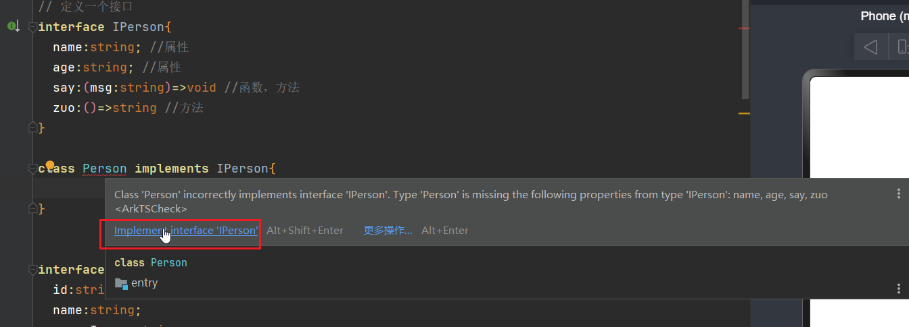
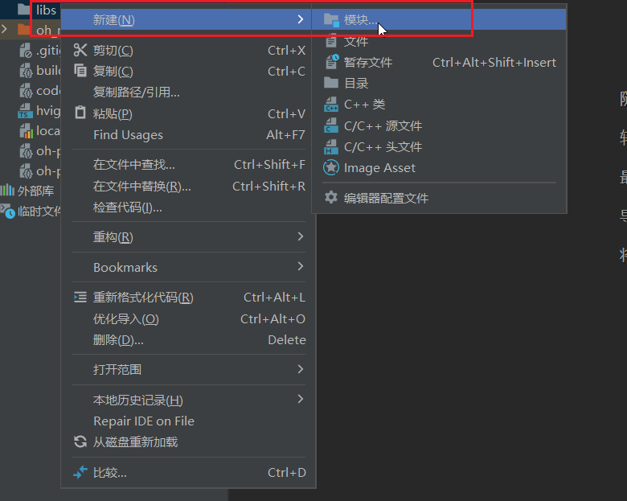
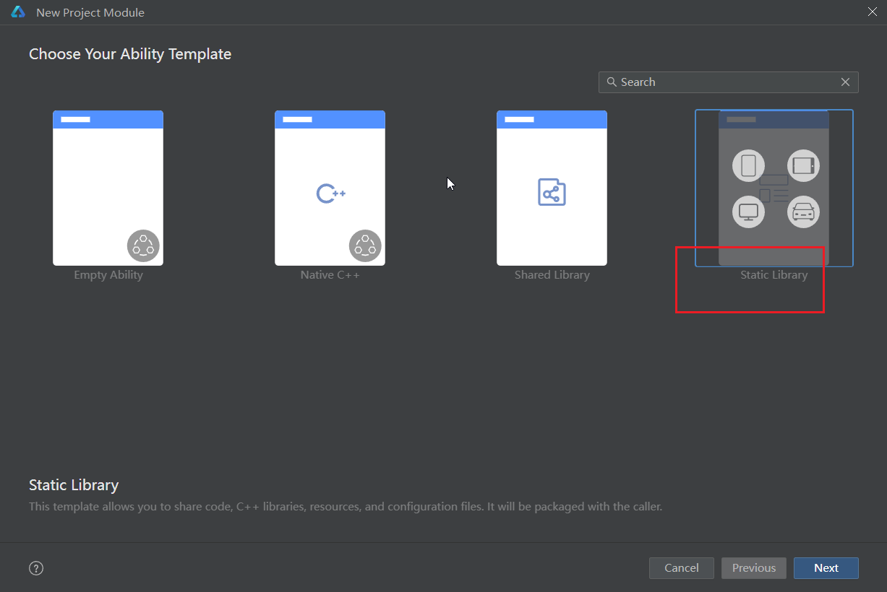
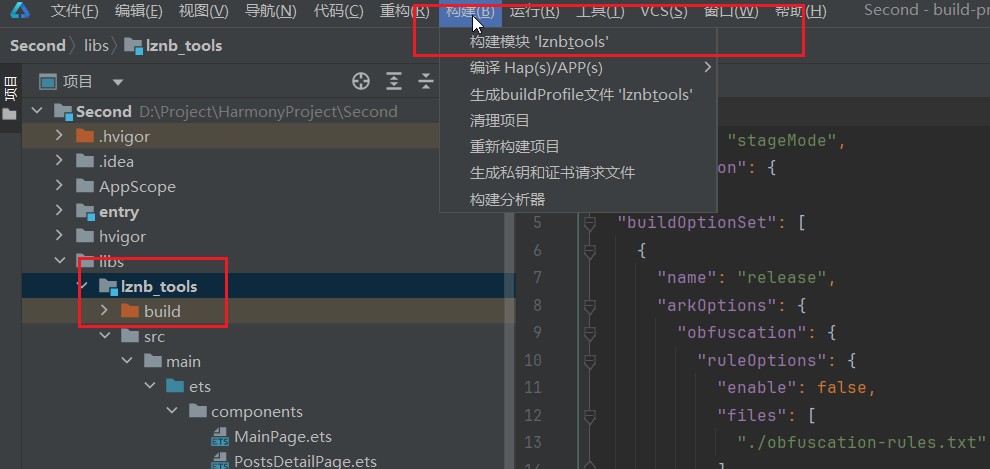
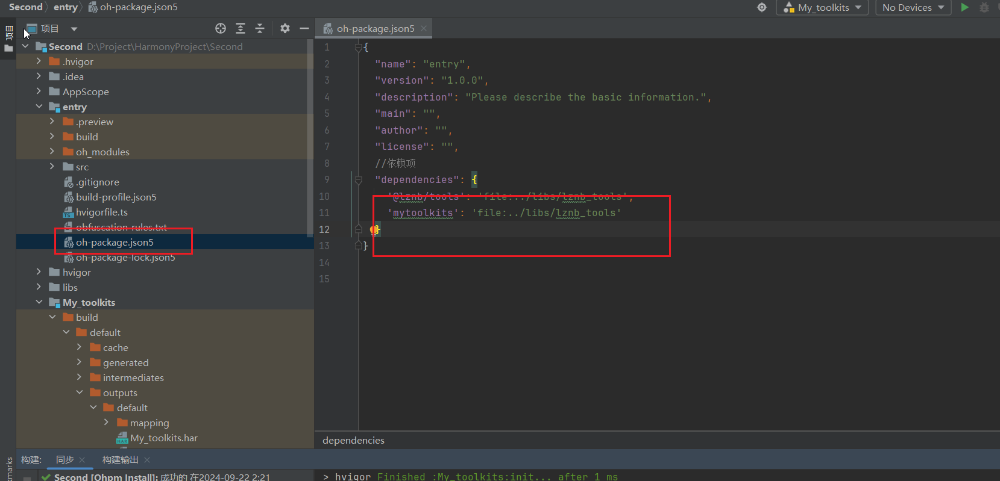
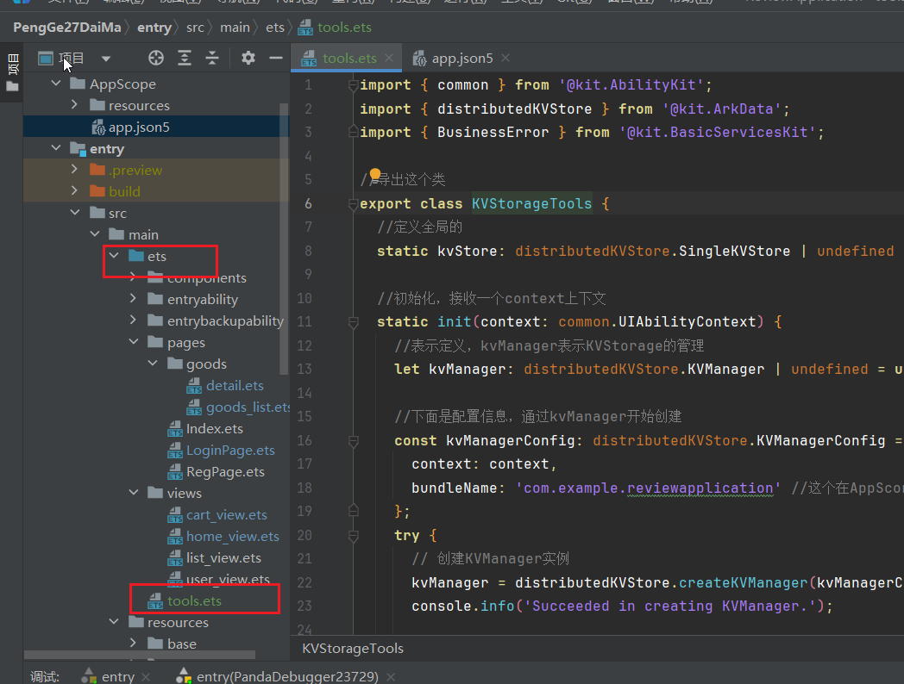
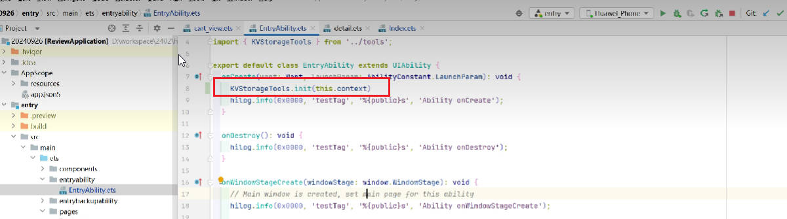

// 装饰器
import { CircleShape } from '@kit.ArkUI';
import { InputMethodListDialog } from '@ohos.inputMethodList';

@Entry //主入口，一个页面只能有一个主入口
@Component //组件
struct Index {
  // struct 表示结构体

  // @State 装饰器修饰的数据是一个响应式的数据，数据改变之后页面会自动更新
  @State message: string = '请输入内容';  //定义一个数据

  // 每一个组件都需要一个build函数，这个函数里面写的是组件的内容
  // 在这个函数内不能写console.log输出，不能switch case
  // 组件定义的时候，build函数的最外层只能有一个根节点
  build() {
    // RelativeContainer() 相对布局的容器
    // 如果组件可以设置子组件，那么使用{ 子组件 }
    // Column() 线性布局 列的意思，从上往下一个一个排
    Column() {
      Image("https://img.clnya.fun/chlorine-coder.webp")
        .width('40%')
        .borderRadius('300px')
        .margin({
          top:'10'
        })// 如果模拟器中使用网络图片，需要设置权限
      TextInput({
        placeholder:'请输入用户名'
      })
        .margin({
          top:'10'
        })
      TextInput({
        placeholder:'请输入密码'
      })
        .type(InputType.Password)
      Button("登录")
        .margin({
          top:'10'
        })
        .backgroundColor('#ff56632')
        .fontColor('black')
        .type(ButtonType.Normal)
        .borderRadius('30px')
      Text('没有账号，我要注册')
        .margin({
          left:'230'
        })
        .fontSize('12')

    }
     //这下面的是全局样式
    .height('100%') //高度 单位是vp 屏幕像素比
    .width('100%')  //宽度
    .backgroundColor('#52999932')
  }
}

# ArkUI 声明式布局

​	https://developer.huawei.com/consumer/cn/doc/harmonyos-guides-V5/arkts-layout-development-linear-V5#%E6%A6%82%E8%BF%B0

## 一、线性布局 (Row/Column)

## 

​	线性布局（LinearLayout）是开发中最常用的布局，通过线性容器[Row](https://developer.huawei.com/consumer/cn/doc/harmonyos-references-V5/ts-container-row-V5)和[Column](https://developer.huawei.com/consumer/cn/doc/harmonyos-references-V5/ts-container-column-V5)构建。线性布局是其他布局的基础，其子元素在线性方向上（水平方向和垂直方向）依次排列。线性布局的排列方向由所选容器组件决定，Column容器内子元素按照垂直方向排列，Row容器内子元素按照水平方向排列。根据不同的排列方向，开发者可选择使用Row或Column容器创建线性布局。


###   1.Column竖排布局 

​	`一排一个，竖着往下排`


```ts
 //表示竖排
 Column({
        space:12 //间距
      }){
     	ColumnSplit(){
           Button('点一下')
        } //会多出来一根分割线，每个ColumnSplit都会有一根下划线
       
        Button('点两下')
        Button('点三下')
        Button('点四下')
        Button('点五下')
      }
      .width('100%')
      .justifyContent(FlexAlign.SpaceAround) //平均分
      .backgroundColor('#339999')
      .padding('18')
```

###    左右对齐

```ts
.alignItems(HorizontalAlign.Start) //左对齐
.alignItems(HorizontalAlign.End) //右对齐 横向布局
.justifyContent(FlexAlign.End) //纵向布局
```


### 2.Row横排布局 

​	`一排好几个，横着排`


.alignItems(VerticalAlign.Center) //垂直居中对齐
.justifyContent(FlexAlign.Center) //水平居中

```ts
 //   横排
      Row({
        space:12 //间距
      }){
        Button('点一下')
        Button('点两下')
        Button('点三下')
        Button('点四下')
        Button('点五下')
      }
      .width('100%')
      .justifyContent(FlexAlign.SpaceAround) //平均分
      .backgroundColor('#339999')
      .padding('18')
```


### 3.scroll滚动 

​	`在布局外设置滚动，超出的范围就会有滚动条`

  scrollable(ScrollDirection.Horizontal) //设置滚动方向

  scrollBar(BarState.Off) /设置滚动条的状态，off表示不显示滚动条

.align(Alignment.Top) //最上面排列

```ts
   //设置超出的部分显示滚动条
      Scroll() {
        Row({
          space:12 //间距
        }){
          Button('点一下')
          Button('点两下')
          Button('点三下')
          Button('点四下')
          Button('点五下')
        }
        .justifyContent(FlexAlign.SpaceAround) //平均分
        .backgroundColor('#339999')
        .padding('18')
      }
		.scrollable(ScrollDirection.Horizontal) //设置滚动方向
		.scrollBar(BarState.Off) //设置滚动条的状态，off表示不显示滚动条
		.align(Alignment.Top) //里面的内容顶部排列
      }
  }
}
```


## 二、Stack()层叠布局

   `层叠布局,一个一个的在中心位置进行叠加`

​	层叠布局（StackLayout）用于在屏幕上预留一块区域来显示组件中的元素，提供元素可以重叠的布局。层叠布局通过[Stack](https://developer.huawei.com/consumer/cn/doc/harmonyos-references-V5/ts-container-stack-V5)容器组件实现位置的固定定位与层叠，容器中的子元素依次入栈，后一个子元素覆盖前一个子元素，子元素可以叠加，也可以设置位置。

​	层叠布局具有较强的页面层叠、位置定位能力，其使用场景有广告、卡片层叠效果等。


```ts
  //层叠布局,一个一个的在中心位置进行叠加,按钮会挤在一起
      Stack(){
        Button('按钮1')
          .offset({ //以自身的位置进行偏移
            bottom:120
          }).align(Alignment.Bottom) //按钮内部的字进行移动
        Button('按钮2')
        Button('按钮3')
          .margin({
            top:80
          })
        Text('这是一段文本')
      }
      .backgroundColor('#993399')
      .width('80%')
      .height(300)
```


## 三、RelativeContainer相对布局

​	在应用的开发过程中，经常需要设计复杂界面，此时涉及到多个相同或不同组件之间的嵌套。如果布局组件嵌套深度过深，或者嵌套组件数过多，会带来额外的开销。如果在布局的方式上进行优化，就可以有效的提升性能，减少时间开销。

​	RelativeContainer为采用相对布局的容器，支持容器内部的子元素设置相对位置关系，适用于界面复杂场景的情况，对多个子组件进行对齐和排列。子元素支持指定兄弟元素作为锚点，也支持指定父容器作为锚点，基于锚点做相对位置布局。下图是一个RelativeContainer的概念图，图中的虚线表示位置的依赖关系。


```ts
 //相对布局容器
      RelativeContainer(){
      	Text('这是最好的时代，也是最坏的时代')
          .id('text') //设置参考id
        Button("穿越吧，少年")
          .alignRules({
            top:{
               anchor:'topSpan', //锚点，参考组件
               align:VerticalAlign.Top //对应的参考物的边界
            },
            left:{
                anchor:'topSpan',
                align:HorizontalAligin.End
            }
        })
        Row()
          .width(200)
          .height(20)
          .bakgroundColor('#990099')
          //.position({
          // top:80
          // })
          .id('topSpan') //设置一个id，让按钮锚点定位这里
          .alignRules({
            top:{
                anchor:'text', //锚点是text
                alig:VerticalAligin.Center //设置到文本的中间位置
            }
        })
      }
      .width('100%')
      .height(150)
      .backgroundColor('#333366')
      }
```


## 四、List列表组件

​	 List() 	// List是一个列表组件

​     ListItem()   // 每一项需要使用ListItem进行包括

​							`ListItem里面只能放一个组件，可以放一个布局，然后布局里套其他的组件`

​	  .lanes(3)    //每一行排放的数量

```ts
  // List是一个列表组件
    List({
      space:16 //上下的间距
    }){
      // 每一项需要使用ListItem进行包括
      ListItem(){
        Column(){
          Image('https://img0.baidu.com/it/u=87766000,1151851566&fm=253&fmt=auto&app=138&f=JPEG?w=500&h=889')
          Text('黑塔')
        }
        .padding(2)
        .border({
          width:{
            bottom:1
          },
          color:'#996699'
        })
        .margin(2)
      }
      ListItem(){
        Column(){
          Image('https://img0.baidu.com/it/u=87766000,1151851566&fm=253&fmt=auto&app=138&f=JPEG?w=500&h=889')
          Text('黑塔')
        }
        .padding(12)
      }
      ListItem(){
        Column(){
          Image('https://img0.baidu.com/it/u=87766000,1151851566&fm=253&fmt=auto&app=138&f=JPEG?w=500&h=889')
          Text('黑塔')
        }
        .padding(12)
      }
      ListItem(){
        Column(){
          Image('https://img0.baidu.com/it/u=87766000,1151851566&fm=253&fmt=auto&app=138&f=JPEG?w=500&h=889')
          Text('黑塔')
        }
        .padding(12)
      }
      ListItem(){
        Column(){
          Image('https://img0.baidu.com/it/u=87766000,1151851566&fm=253&fmt=auto&app=138&f=JPEG?w=500&h=889')
          Text('黑塔')
        }
        .padding(12)
      }
    }
    .lanes(3) //每一行排放的数量
    .height('100%')
    .width('100%')
  }
```


###     1.List分组和滑动行为

​    ListItemGroup()  //分组

   ListItemGroup(header)  //头部信息

   swipeAction  //滑动行为，加了就可以滑动

   sticky(StickyStyle.Header)  //使分组有吸顶效果

```ts
ListItemGroup({
  header: this.itemHeader('我想她了'),  //头部信息
  space: 6  //分组里ListItem间距
}) 
```

```ts
swipeAction({   //滑动行为，加了就可以滑动
  end: this.delBuilder('火影忍者'), //右滑
  start: this.delBuilder('火影忍者') //左滑
})
```

​    完整代码如下:

```ts
@Entry
@Component
struct UlistPage {
  @Builder //装饰器
  itemHeader(text: string) {
    Column() {
      Text(text)
        .fontSize(24)
    }
    .backgroundColor('#999')
    .padding(14)

  }

  @Builder
  delBuilder(text:string) {
    Column() {
      Button(text)
      Button(text)
    }

  }

  build() {
    Column() {
      List({
        space: 6 //这个是ListItemGroup分组之间的间距
      }) {
        ListItem() {
          Row() {
            Text('王者荣耀')
            Blank() //撑开
            Button('点一下')
          }.width('100%')
        }

        //分组1
        ListItemGroup({
          header: this.itemHeader('我想她了'),
          space: 6
        }) {
          ListItem() {
            Column() {
              Text('火影忍者')
                .fontSize('#fff')
            }
            .height(200)
            .width('100%')
            .backgroundColor('#993333')
          }.swipeAction({
            //滑动行为，加了就可以滑动
            end: this.delBuilder('火影忍者'), //右滑
            start: this.delBuilder('火影忍者') //左滑
          })

          ListItem() {
            Column() {
              Text('诸葛亮')
                .fontSize('#fff')
            }
            .height(200)
            .width('100%')
            .backgroundColor('#993333')
          }

          ListItem() {
            Column() {
              Text('香格里拉')
                .fontSize('#fff')
            }
            .height(200)
            .width('100%')
            .backgroundColor('#993333')
          }

          ListItem() {
            Column() {
              Text('孔明')
                .fontSize('#fff')
            }
            .height(200)
            .width('100%')
            .backgroundColor('#993333')
          }

          ListItem() {
            Column() {
              Text('Java')
                .fontSize('#fff')
            }
            .height(200)
            .width('100%')
            .backgroundColor('#993333')
          }
          .swipeAction({
            //滑动行为，加了就可以滑动
            end: this.delBuilder('Java是最好的语言'), //右滑
            start: this.delBuilder('Java是最好的语言') //左滑
          })
        }

        //分组2
        ListItemGroup({
          header: this.itemHeader('下面都是最好的语言')
        }) {
          ListItem() {
            Column() {
              Text('c#是最好的语言')
                .fontSize('#fff')
            }
            .height(200)
            .width('100%')
            .backgroundColor('#339999')
          }

          ListItem() {
            Column() {
              Text('python是最好的语言')
                .fontSize('#fff')
            }
            .height(200)
            .width('100%')
            .backgroundColor('#339999')
          }

          ListItem() {
            Column() {
              Text('php才是最好的语言')
                .fontSize('#fff')
            }
            .height(200)
            .width('100%')
            .backgroundColor('#339999')
          }

        }

      }
      .sticky(StickyStyle.Header) //使分组有吸顶效果
    }
    .height('100%')
    .width('100%')
  }
}
```


### 2.List列表组件

​	 List() 	// List是一个列表组件

​     ListItem()   // 每一项需要使用ListItem进行包括

​	  .lanes(3)    //每一行排放的数量

```ts
  // List是一个列表组件
    List({
      space:16 //上下的间距
    }){
      // 每一项需要使用ListItem进行包括
      ListItem(){
        Column(){
          Image('https://img0.baidu.com/it/u=87766000,1151851566&fm=253&fmt=auto&app=138&f=JPEG?w=500&h=889')
          Text('黑塔')
        }
        .padding(2)
        .border({
          width:{
            bottom:1
          },
          color:'#996699'
        })
        .margin(2)
      }
      ListItem(){
        Column(){
          Image('https://img0.baidu.com/it/u=87766000,1151851566&fm=253&fmt=auto&app=138&f=JPEG?w=500&h=889')
          Text('黑塔')
        }
        .padding(12)
      }
      ListItem(){
        Column(){
          Image('https://img0.baidu.com/it/u=87766000,1151851566&fm=253&fmt=auto&app=138&f=JPEG?w=500&h=889')
          Text('黑塔')
        }
        .padding(12)
      }
      ListItem(){
        Column(){
          Image('https://img0.baidu.com/it/u=87766000,1151851566&fm=253&fmt=auto&app=138&f=JPEG?w=500&h=889')
          Text('黑塔')
        }
        .padding(12)
      }
      ListItem(){
        Column(){
          Image('https://img0.baidu.com/it/u=87766000,1151851566&fm=253&fmt=auto&app=138&f=JPEG?w=500&h=889')
          Text('黑塔')
        }
        .padding(12)
      }
    }
    .lanes(3) //每一行排放的数量
    .height('100%')
    .width('100%')
  }
```


### 3.onReachStart列表下拉刷新

```ts
.onReachStart(()=>{ //列表下拉刷新
       promptAction.showToast({
         message:'到顶了'
       })
     })
     .onReachEnd(()=>{ //列表上拉刷新
      // 如果没有数据的时候，会直接触发这个到底的函数，所以我加一个判断
      if(this.goodsList.length>0){
        loadDataFromServer(this.page,this.keyword)
          .then(res=>{
            this.goodsList.push(...res)
            this.page++
          })
      }
     })
```


## 五-1、Flex布局

Flex()  //默认是横排

direction:FlexDirection.Column //主轴排列方向设置为竖排

.flexGrow(1) //撑满剩下的空间，但是竖向的撑满

```ts
@Entry
@Component
struct UFlexPage {


  build() {
    Flex({ //默认是横排
      direction:FlexDirection.Column //主轴排列方向设置为竖排
    }){
      Text('Java')
        .backgroundColor('red')
        .width('100%')
        .textAlign(TextAlign.Center)
      Text('Python')
      Text('JavaScript')
      Text('typescript')
        .backgroundColor('#ff0099')
        .flexGrow(1) //撑满剩下的空间，但是竖向的撑满
      Flex(){
        Column(){

        }
        .width('25%')
        .backgroundColor('#fff')
        .height('100%')
        Row(){
          // 竖排
          Column(){
            Text('Hello World!')
            Button('世界你好')
          }
          .flexGrow(1)
          Text('这是最->')
        }
        .flexGrow(1)
      }
      .backgroundColor('#cecece')
      .width('100%')
      .flexGrow(1) //撑满剩下的空间，但是竖向的撑满
    }
    .align(Alignment.Center) 
    .width('100%')
    .height('100%')
  }
}
```

### flex布局

```ts
Flex({
      direction:FlexDirection.Column,
      // justifyContent:FlexAlign.SpaceBetween
    }){
      RelativeContainer(){
        Text('为了德玛西亚')
          .textAlign(TextAlign.Center)
          .fontColor('#fff')
          .fontSize(20)
          .width('100%')
        Button('登录')
          .onClick(()=>{
            promptAction.showToast({
              message:"这是一个轻提示弹窗"
            })
          })
      }
        .height(80)
        .backgroundColor('#339933')
        .width('100%')
      Column(){
        Text('这是第一行')
        Text('这是第二行')
        Text('这是第三行')
      }
      Row()
        .height(50)
        .backgroundColor('#669966')
        .width('100%')
    }
    .flexGrow(1)
    .height('100%')
    .width('100%')
  }
```


## 五-2、栅格布局 (GridRow/GridCol)

https://developer.huawei.com/consumer/cn/doc/harmonyos-guides-V5/arkts-layout-development-grid-layout-V5

栅格布局是一种通用的辅助定位工具，对移动设备的界面设计有较好的借鉴作用。主要优势包括：

1. 提供可循的规律：栅格布局可以为布局提供规律性的结构，解决多尺寸多设备的动态布局问题。通过将页面划分为等宽的列数和行数，可以方便地对页面元素进行定位和排版。
2. 统一的定位标注：栅格布局可以为系统提供一种统一的定位标注，保证不同设备上各个模块的布局一致性。这可以减少设计和开发的复杂度，提高工作效率。
3. 灵活的间距调整方法：栅格布局可以提供一种灵活的间距调整方法，满足特殊场景布局调整的需求。通过调整列与列之间和行与行之间的间距，可以控制整个页面的排版效果。
4. 自动换行和自适应：栅格布局可以完成一对多布局的自动换行和自适应。当页面元素的数量超出了一行或一列的容量时，他们会自动换到下一行或下一列，并且在不同的设备上自适应排版，使得页面布局更加灵活和适应性强。

[GridRow](https://developer.huawei.com/consumer/cn/doc/harmonyos-references-V5/ts-container-gridrow-V5)为栅格容器组件，需与栅格子组件[GridCol](https://developer.huawei.com/consumer/cn/doc/harmonyos-references-V5/ts-container-gridcol-V5)在栅格布局场景中联合使用。


## 六、生命周期

### 1.页面和组件生命周期函数

鸿蒙中的生命周期分为页面的生命周期和组件的生命周期

```ts
@Entry
@Component
struct ListPage {
    
// 生命周期钩子函数，组件创建的时候执行
aboutToAppear(): void {
    console.log('detail---aboutToAppear')
    // 此处一般用来调接口获取数据
  }

  // 只有在组件设置为@Entry之后才有的声明周期钩子函数 onPageShow onPageHide
  // 页面展示的时候执行
  onPageShow(): void {
    console.log('detail---onPageShow')
  }

  // 页面隐藏的时候执行
  onPageHide(): void {
    console.log('detail---onPageHide')
  }

  // build之后执行
  onDidBuild(): void {
    console.log('detail---onDidBuild')
  }

  // 组件销毁的时候执行
  aboutToDisappear(): void {
    console.log('detail---aboutToDisappear')
  }
```


## 七、uiability组件和应用跳转

### 1.UIAbility组件和WindowStage生命周期   

官方文档:https://developer.huawei.com/consumer/cn/doc/harmonyos-guides-V5/uiability-lifecycle-V5


`EntryAbilityets里面也有生命周期`

比如说监听任务栏拉下来失去焦点和获取焦点应该怎么办

```ts
import { AbilityConstant, UIAbility, Want } from '@kit.AbilityKit';
import { hilog } from '@kit.PerformanceAnalysisKit';
import { window } from '@kit.ArkUI';

export default class EntryAbility extends UIAbility {
  // 创建的时候执行
  onCreate(want: Want, launchParam: AbilityConstant.LaunchParam): void {
    hilog.info(0x0000, 'testTag', '%{public}s', 'Ability onCreate');
  }

  //销毁的时候执行
  onDestroy(): void {
    hilog.info(0x0000, 'testTag', '%{public}s', 'Ability onDestroy');
  }

  // WindowStage创建之后执行
  // WindowStage相当于一个容器，这个容器是用来展示我们的ui组件的
  onWindowStageCreate(windowStage: window.WindowStage): void {
    // Main window is created, set main page for this ability
    hilog.info(0x0000, 'testTag', '%{public}s', 'Ability onWindowStageCreate');

    // 加载一个页面进行显示
    // 第一个参数表示我们加载的初始化页面的地址
    windowStage.loadContent('pages/Index', (err) => {
      if (err.code) {
        hilog.error(0x0000, 'testTag', 'Failed to load the content. Cause: %{public}s', JSON.stringify(err) ?? '');
        return;
      }
      hilog.info(0x0000, 'testTag', 'Succeeded in loading the content.');
    });

    //这里可以监听windowStage的各种事件，比如windowStageEvent
    //windowStageEvent可以监听windowStage的改变事件，我们通过类型值获取对应的状态信息
    // https://developer.huawei.com/consumer/cn/doc/harmonyos-guides-V5/uiability-lifecycle-V5
    // windowStage生命周期相关内容
    windowStage.on("windowStageEvent",(e)=>{
      // window.WindowStageEventType，可以获取对应的事件类型
      // window.WindowStageEventType.SHOWN
      if( window.WindowStageEventType.ACTIVE==e){ //.ACTIVE获取焦点
        console.log('页面获取到焦点');
      }
      if( window.WindowStageEventType.INACTIVE==e){ //.INACTIVE失去焦点
        console.log('页面失去焦点');
      }
      // console.log(e.toString())
    })
  }

  // WindowStage销毁的时候执行
  onWindowStageDestroy(): void {
    // Main window is destroyed, release UI related resources
    hilog.info(0x0000, 'testTag', '%{public}s', 'Ability onWindowStageDestroy');
  }

  // 应用切换到前台的时候执行
  onForeground(): void {
    // Ability has brought to foreground
    hilog.info(0x0000, 'testTag', '%{public}s', 'Ability onForeground');
  }

  // 应用切换到后台的时候执行
  onBackground(): void {
    // Ability has back to background
    hilog.info(0x0000, 'testTag', '%{public}s', 'Ability onBackground');
  }
}

// 生命周期顺序 onCreate onWindowStageCreate  windowStage  onForeground
```


### 2.UIAbility组件启动模式

系统提供了三种启动模式：

```ts
// 三种模式
// 单例模式，默认的，一次启动一个uiability
// 多例模式，可以通过设置，让我们的app具备多个uiability
// 指定ability模式，指定启动的uiability
```


### 3.应用之间通过startAbility进行跳转

#### ①.单例模式

   下面通过`单例模式`打开一个新的app

​    通过已有的app打开一个新的app页面，例如:火影忍者使用qq登录

`module.json5`

```ts
 "abilities": [
      {
        "name": "EntryAbility",
        "srcEntry": "./ets/entryability/EntryAbility.ets",
        "description": "$string:EntryAbility_desc",
        "icon": "$media:layered_image",
        "label": "$string:EntryAbility_label",
        "launchType": "singleton", //单例模式，修改这个即可
        "startWindowIcon": "$media:startIcon",
        "startWindowBackground": "$color:start_window_background",
        "exported": true,
```

`index.ets`

```ts
import { abilityAccessCtrl, common, Want } from '@kit.AbilityKit';
import { geoLocationManager } from '@kit.LocationKit';

@Entry
@Component
struct Index {
  @State message: string = 'Hello World';


  build() {
    Column() {
      Button('打开应用')
        .onClick(()=>{
        // 打开一个app的时候，需要配置want信息
          let want:Want={
            // 以下参数是第三方app给我们提供的，一般第三方app都会给我们一个SDK开发包
            // 我们引入这个SDK之后就能使用了，SDK类似于npm i下载的第三方插件
            abilityName:'EntryAbility', // module.json5/"abilities"/name: 都是第三方app提供的
            bundleName:'com.example.test1007', // AppScope/app.json5/"bundleName" 都是第三方app提供的
            deviceId:'', //设备id，如果为空，表示打开当前设备上的app
          }
          let context= getContext() as common.UIAbilityContext
          context.startAbility(want) //打开一个新的app，唤醒一个应用

        })
    }
    .height('100%')
    .width('100%')
  }
}
```


#### ②.多例模式

  类似游戏多开，同一个app页面可以打开无数个

  下面通过`多例模式`打开一个新的app

`module.json5`

```ts
 "abilities": [
      {
        "name": "EntryAbility",
        "srcEntry": "./ets/entryability/EntryAbility.ets",
        "description": "$string:EntryAbility_desc",
        "icon": "$media:layered_image",
        "label": "$string:EntryAbility_label",
        "launchType": "multiton", //多例模式，修改这个即可
```

`index.ets`的代码和上面一致，只要是多实例模式即可

```ts
import { abilityAccessCtrl, common, Want } from '@kit.AbilityKit';
import { geoLocationManager } from '@kit.LocationKit';

@Entry
@Component
struct Index {
  @State message: string = 'Hello World';


  build() {
    Column() {
      Button('打开应用')
        .onClick(()=>{
        // 打开一个app的时候，需要配置want信息
          let want:Want={
            // 以下参数是第三方app给我们提供的，一般第三方app都会给我们一个SDK开发包
            // 我们引入这个SDK之后就能使用了，SDK类似于npm i下载的第三方插件
            abilityName:'EntryAbility', // module.json5/"abilities"/name: 都是第三方app提供的
            bundleName:'com.example.test1007', // AppScope/app.json5/"bundleName" 都是第三方app提供的
            deviceId:'', //设备id，如果为空，表示打开当前设备上的app
          }
          let context= getContext() as common.UIAbilityContext
          context.startAbility(want) //打开一个新的app，唤醒一个应用

        })
    }
    .height('100%')
    .width('100%')
  }
}
```


#### ③.应用之间传参

  官方网址:https://developer.huawei.com/consumer/cn/doc/harmonyos-guides-V5/link-between-apps-overview-V5,应用之间进行跳转

向另一个app传递的参数，自己打开其他app的时候传递过去的数据，在Want中添加parameters这一行

 `传参`index.ets

```ts
 let want:Want={
            // 以下参数是第三方app给我们提供的，一般第三方app都会给我们一个SDK开发包
            // 我们引入这个SDK之后就能使用了，SDK类似于npm i下载的第三方插件
            abilityName:'EntryAbility', // module.json5/"abilities"/name: 都是第三方app提供的
            bundleName:'com.example.test1007', // AppScope/app.json5/"bundleName" 都是第三方app提供的
            deviceId:'', //设备id，如果为空，表示打开当前设备上的app
     
            // 参数，向另一个app传递的参数，自己打开其他app的时候传递过去的数据
            parameters:{
              id:'666',
              info:'2024年10月9日晚上23点17分'
            }
          }
```

`获取参数`在EntryAbility.ets中可以获取别的应用传过来的参数

```ts
export default class EntryAbility extends UIAbility {
  // 创建的时候执行
  onCreate(want: Want, launchParam: AbilityConstant.LaunchParam): void {
    want.parameters // 获取上一个app传递过来的参数，根据参数我们就可以做相应的操作
    hilog.info(0x0000, 'testTag', '%{public}s', 'Ability onCreate');
  }
```


### 4.冷启动和热启动

#### ①.冷启动和热启动

  ` 冷启动`，就是我们的app还没有在运行
   唤醒的时候会执行创建到挂载展示页面的整个过程

  ` 热启动`，newWant，当我们的应用已经启动，但是不在前台的时候，我们唤醒这个app的时候
   应用不再执行创建的生命周期钩子函数，此为热启动

```ts
 // 冷启动，就是我们的app还没有在运行
  // 唤醒的时候会执行创建到挂载展示页面的整个过程

  //
  // newWant，当我们的应用已经启动，但是不在前台的时候，我们唤醒这个app的时候，会进入这个钩子函数
  // 应用不再执行创建的生命周期钩子函数，此为热启动
  onNewWant(want: Want, launchParam: AbilityConstant.LaunchParam): void {
    console.log('---new want--- 热启动')
  }
```


#### ②.根据传递的参数打开不同的页面

`b应用，index.ets`

```ts
import { abilityAccessCtrl, common, Want } from '@kit.AbilityKit';
import { geoLocationManager } from '@kit.LocationKit';

@Entry
@Component
struct Index {
  @State message: string = 'Hello World';


  build() {
    Column() {
      Button('打开应用')
        .onClick(()=>{
        // 打开一个app的时候，需要配置want信息
          let want:Want={
            // 以下参数是第三方app给我们提供的，一般第三方app都会给我们一个SDK开发包
            // 我们引入这个SDK之后就能使用了，SDK类似于npm i下载的第三方插件
            abilityName:'EntryAbility', // module.json5/"abilities"/name: 都是第三方app提供的
            bundleName:'com.example.test1007', // AppScope/app.json5/"bundleName" 都是第三方app提供的
            deviceId:'', //设备id，如果为空，表示打开当前设备上的app
            // 参数，向另一个app传递的参数，自己打开其他app的时候传递过去的数据
            parameters:{
              id:'666',
              info:'2024年10月9日晚上23点17分'
            }
          }
          let context= getContext() as common.UIAbilityContext
          context.startAbility(want) //打开一个新的app，唤醒一个应用

        })
      Button("打开支付页面")
        .onClick(()=>{
          let want:Want={
            // 以下参数是第三方app给我们提供的，一般第三方app都会给我们一个SDK开发包
            // 我们引入这个SDK之后就能使用了，SDK类似于npm i下载的第三方插件
            abilityName:'EntryAbility', // module.json5/"abilities"/name: 都是第三方app提供的
            bundleName:'com.example.test1007', // AppScope/app.json5/"bundleName" 都是第三方app提供的
            deviceId:'', //设备id，如果为空，表示打开当前设备上的app
            // 参数，向另一个app传递的参数，自己打开其他app的时候传递过去的数据
            parameters:{
              id:'666',
              info:'2024年10月9日晚上23点17分',
              action:'支付'
            }
          }
          let context= getContext() as common.UIAbilityContext
          context.startAbility(want) //打开一个新的app，唤醒一个应用

        })
    }
    .height('100%')
    .width('100%')
  }
}
```

`a应用，EntryAbility`

```ts
import { AbilityConstant, UIAbility, Want } from '@kit.AbilityKit';
import { hilog } from '@kit.PerformanceAnalysisKit';
import { router, window } from '@kit.ArkUI';


export default class EntryAbility extends UIAbility {

  _actionPagge:string='pages/Index' // 自定义的接收参数，用来判断跳转到哪一个页面

  onCreate(want: Want, launchParam: AbilityConstant.LaunchParam): void {
    hilog.info(0x0000, 'testTag', '%{public}s', 'Ability onCreate');
    if(want.parameters&&want.parameters.action){
      let action = want.parameters.action as string
      if(action=='pay'){
        this._actionPagge='pages/PayPage'
      }
    }
  }

  onDestroy(): void {
    hilog.info(0x0000, 'testTag', '%{public}s', 'Ability onDestroy');
  }

  onWindowStageCreate(windowStage: window.WindowStage): void {
    // Main window is created, set main page for this ability
    hilog.info(0x0000, 'testTag', '%{public}s', 'Ability onWindowStageCreate');


    windowStage.loadContent(this._actionPagge, (err) => {
      if (err.code) {
        hilog.error(0x0000, 'testTag', 'Failed to load the content. Cause: %{public}s', JSON.stringify(err) ?? '');
        return;
      }
      hilog.info(0x0000, 'testTag', 'Succeeded in loading the content.');
    });
  }

  onWindowStageDestroy(): void {
    // Main window is destroyed, release UI related resources
    hilog.info(0x0000, 'testTag', '%{public}s', 'Ability onWindowStageDestroy');
  }

  onForeground(): void {
    // Ability has brought to foreground
    hilog.info(0x0000, 'testTag', '%{public}s', 'Ability onForeground');
  }

  onBackground(): void {
    // Ability has back to background
    hilog.info(0x0000, 'testTag', '%{public}s', 'Ability onBackground');
  }

  // 冷启动，就是我们的app还没有在运行
  // 唤醒的时候会执行创建到挂载展示页面的整个过程

  //
  // newWant，当我们的应用已经启动，但是不在前台的时候，我们唤醒这个app的时候，会进入这个钩子函数
  // 应用不再执行创建的生命周期钩子函数，此为热启动
  onNewWant(want: Want, launchParam: AbilityConstant.LaunchParam): void {
    console.log('---new want--- 热启动')
    if (want.parameters && want.parameters.action) {
      let action = want.parameters.action as string
      if(action=='pay'){
        this._actionPagge='pages/PayPage'
        router.pushUrl({
          url:this._actionPagge
        })
      }
    }
  }
}
```


### 5.ability和页面之间通信(难点)

`事件派发`类似于vue中的事件总线

​	   事件，是一种通信机制，所有的事件派发和监听都需要在同一个主体对象上进行。可以实现事件数据在不同的页面之间传递
​       监听，注册监听函数，当接收到这个事件名字的时候，会执行回调函数
​       派发，派发一个事件名字并传递参数，所有在事件接收主体上的注册了事件的位置都会接收到

`EntryAbility.ets`

```ts
import { AbilityConstant, UIAbility, Want } from '@kit.AbilityKit';
import { hilog } from '@kit.PerformanceAnalysisKit';
import { window } from '@kit.ArkUI';

// 三种模式
// 单例模式，默认的，一次启动一个uiability
// 多例模式，可以通过设置，让我们的app具备多个uiability
// 指定ability模式，指定启动的uiability

export default class EntryAbility extends UIAbility {
  // 创建的时候执行
  onCreate(want: Want, launchParam: AbilityConstant.LaunchParam): void {
    want.parameters // 获取上一个app传递过来的参数，根据参数我们就可以做相应的操作
    hilog.info(0x0000, 'testTag', '%{public}s', 'Ability onCreate');
  }

  //销毁的时候执行
  onDestroy(): void {
    hilog.info(0x0000, 'testTag', '%{public}s', 'Ability onDestroy');
  }

  // WindowStage创建之后执行
  // WindowStage相当于一个容器，这个容器是用来展示我们的ui组件的
  onWindowStageCreate(windowStage: window.WindowStage): void {
    // Main window is created, set main page for this ability
    hilog.info(0x0000, 'testTag', '%{publice}s', 'Ability onWindowStageCreate');

    // eventHub是事件监听的意思
    // 可以实现页面组件和Ability之间的数据通信
    this.context.eventHub.on("bbbb",(a:string)=>{
      console.log("a的值为:"+a)
    })

    // 加载一个页面进行显示
    // 第一个参数表示我们加载的初始化页面的地址
    windowStage.loadContent('pages/Index', (err) => {
      if (err.code) {
        hilog.error(0x0000, 'testTag', 'Failed to load the content. Cause: %{public}s', JSON.stringify(err) ?? '');
        return;
      }
      hilog.info(0x0000, 'testTag', 'Succeeded in loading the content.');
    });

    //这里可以监听windowStage的各种事件，比如windowStageEvent
    //windowStageEvent可以监听windowStage的改变事件，我们通过类型值获取对应的状态信息
    // https://developer.huawei.com/consumer/cn/doc/harmonyos-guides-V5/uiability-lifecycle-V5
    // windowStage生命周期相关内容
    windowStage.on("windowStageEvent",(e)=>{
      // window.WindowStageEventType，可以获取对应的事件类型
      // window.WindowStageEventType.SHOWN
      if( window.WindowStageEventType.ACTIVE==e){ //.ACTIVE获取焦点
        console.log('页面获取到焦点');
      }
      if( window.WindowStageEventType.INACTIVE==e){ //.INACTIVE失去焦点
        console.log('页面失去焦点');
      }
      // console.log(e.toString())
    })
  }

  // WindowStage销毁的时候执行
  onWindowStageDestroy(): void {
    // Main window is destroyed, release UI related resources
    hilog.info(0x0000, 'testTag', '%{public}s', 'Ability onWindowStageDestroy');
  }

  // 应用切换到前台的时候执行
  onForeground(): void {
    // Ability has brought to foreground
    hilog.info(0x0000, 'testTag', '%{public}s', 'Ability onForeground');
  }

  // 应用切换到后台的时候执行
  onBackground(): void {
    // Ability has back to background
    hilog.info(0x0000, 'testTag', '%{public}s', 'Ability onBackground');
  }
}

// 生命周期顺序 onCreate onWindowStageCreate  windowStage  onForeground

```

`index.ets`

```ts
import { abilityAccessCtrl, common, Want } from '@kit.AbilityKit';
import { geoLocationManager } from '@kit.LocationKit';

@Entry
@Component
struct Index {
  @State message: string = 'Hello World';


  build() {
    Column() {
      Button('打开应用')
        .onClick(()=>{
        // 打开一个app的时候，需要配置want信息
          let want:Want={
            // 以下参数是第三方app给我们提供的，一般第三方app都会给我们一个SDK开发包
            // 我们引入这个SDK之后就能使用了，SDK类似于npm i下载的第三方插件
            abilityName:'EntryAbility', // module.json5/"abilities"/name: 都是第三方app提供的
            bundleName:'com.example.test1007', // AppScope/app.json5/"bundleName" 都是第三方app提供的
            deviceId:'', //设备id，如果为空，表示打开当前设备上的app
            // 参数，向另一个app传递的参数，自己打开其他app的时候传递过去的数据
            parameters:{
              id:'666',
              info:'2024年10月9日晚上23点17分'
            }
          }
          let context= getContext() as common.UIAbilityContext
          context.startAbility(want) //打开一个新的app，唤醒一个应用

        })
      Button("打开支付页面")
        .onClick(()=>{
          let want:Want={
            // 以下参数是第三方app给我们提供的，一般第三方app都会给我们一个SDK开发包
            // 我们引入这个SDK之后就能使用了，SDK类似于npm i下载的第三方插件
            abilityName:'EntryAbility', // module.json5/"abilities"/name: 都是第三方app提供的
            bundleName:'com.example.test1007', // AppScope/app.json5/"bundleName" 都是第三方app提供的
            deviceId:'', //设备id，如果为空，表示打开当前设备上的app
            // 参数，向另一个app传递的参数，自己打开其他app的时候传递过去的数据
            parameters:{
              id:'666',
              info:'2024年10月9日晚上23点17分',
              action:'支付'
            }
          }
          let context= getContext() as common.UIAbilityContext
          context.startAbility(want) //打开一个新的app，唤醒一个应用
        })

      Button('传递数据')
        .onClick(()=>{
          let context= getContext() as common.UIAbilityContext //获取上下文
          //名字要和EntryAbility对应的上
          context.eventHub.emit("bbbb","牛逼克斯啦")  //事件派发
        // 事件，是一种通信机制，所有的事件派发和监听都需要在同一个主体对象上进行。可以实现事件数据在不同的页面之间传递
        // 监听，注册监听函数，当接收到这个事件名字的时候，会执行回调函数
        // 派发，派发一个事件名字并传递参数，所有在事件接收主体上的注册了事件的位置都会接收到
        })

    }
    .height('100%')
    .width('100%')
  }
}
```

## 一、自定义组件

### 1.自定义组件Component

```ts
//自定义组件
@Component
struct GoodsView { //定义一个组件
  @Prop name:string='' //父传子，用属性，子组件定义name、price属性
  @Prop price:number=1
  build() {
    Column() {
      Text(this.name)
      Text('￥'+this.price+'元')
    }
    .backgroundColor('#7c999999')
    .padding(12)
    .width('100%')
  }
}
```


### 2.自定义代码块Builder

```ts
@Builder //创建一个自定义builder做显示效果的简单封装
linkTo(txt:string){
    Row(){
        Text(txt)
        Blank()
        Text('>')
    }
    .width('100%')
    .border({
        width:{
            bottom:1
        },
        style:BorderStyle.Solid,
        color:'#999'
    })
    .padding(8)
}

build(){
	Colum(){
     //通过buildder创建一个自定义渲染效果
	this.linkto('我的订单') //用的时候直接调用
	this.linkto('我的人生')
	this.linkto('我的世界')
	}
}
```


## 二、父传子prop

1.prop声明传入的属性默认值

```ts
//@Prop 设置属性，从外面传递数据过来
@Prop name:string='' //父传子，用属性，子组件定义name、price属性
@Prop price:number=1
@Require  @Prop desc:string='' // @Require 表示这个属性必须要传 
```

2.传入的值`互相独立不影响`

```ts
 GoodsView({
        name:'时崎狂三',
        price:1221
      })
 GoodsView({
        name:'五河琴里',
        price:243100
      })
```

完整代码如下:

```ts
//自定义组件
@Component
struct GoodsView { //定义一个组件
  @Prop name:string='' //父传子，用属性，子组件定义name、price属性
  @Prop price:number=1
  build() {
    Column() {
      Text(this.name)
      Text('￥'+this.price+'元')
    }
    .backgroundColor('#7c999999')
    .padding(12)
    .width('100%')
  }
}

@Entry
@Component
struct GoodsPage {
  build() {
    Column() {
      GoodsView({
        name:'时崎狂三',
        price:1221 
      })
    }
    .height('100%')
    .width('100%')
  }
}
```


### @Link实现子组件改变父组件

  如果使用prop，//原来的pp一旦改变，新的pp也会改变

​								    //但新的pp改变，原来的pp却不会改变

  使用Link,里面的改变，外面的也改。外面的改变，里面也会改变

```ts
 @Link mpp:number //@Link定义的数据，不能设置初始值，需要从外面传进来，改变之后对应的数据会跟着响应式变化
 @Link carts:Cart [] //可以实现子组件改变数据之后，父组件数据也进行改变
```

  完整代码如下:

```ts
//自定义组件
@Component
struct GoodsView { //定义一个组件
  @Require @Prop name:string='' //父传子，用属性，子组件定义name、price属性
  @Prop price:number=1
  @Link mpp:number //@Link定义的数据，不能设置初始值，需要从外面传进来，改变之后对应的数据会跟着响应式变化
  build() {
    Column() {
      Text(this.name)
      Text('￥'+this.price+'元')
        .onClick(()=>{
          this.price--
        })
      Text(this.mpp+',传递过来的') //原来的pp一旦改变，这个pp也会改变
        .onClick(()=>{
          this.mpp++ //这个改变，原来的pp不会改变，是全新的值
        })
    }
    .backgroundColor('#7c999999')
    .padding(12)
    .width('100%')
  }
}

@Entry
@Component
struct GoodsPage {
  @State pp:number=100 //动态数据

  build() {
    Column() {
      Text('pp:'+this.pp)
      Button('点击pp减1')
        .onClick(()=>{
          this.pp--
        })
      GoodsView({
        name:'时崎狂三',
        price:1221,
        mpp:this.pp //传一个动态数据
      })
      GoodsView({
        name:'五河琴里',
        price:243100,
        mpp:this.pp //传一个动态数据
      })
      GoodsView({
        name:'五河琴里',
        price:243100,
        mpp:this.pp //传一个动态数据
      })
    }
    .height('100%')
    .width('100%')
  }
}
```


### 组件传函数

```ts
say:()=>void=()=>{} //往组件中传递函数

 GoodsView({
        name:'时崎狂三',
        price:1221,
        mpp:this.pp, //传一个动态数据
        say:()=>{
          // console.log('我是传递进来的数据')
          promptAction.showToast({
            message:'这是我传递进来的参数'
          })
        }
      })
```

  完整代码如下:

```ts
//自定义组件
import { promptAction } from '@kit.ArkUI'

@Component
struct GoodsView { //定义一个组件
  @Require @Prop name:string='' //父传子，用属性，子组件定义name、price属性
  @Prop price:number=1
  @Link mpp:number //@Link定义的数据，不能设置初始值，需要从外面传进来，改变之后对应的数据会跟着响应式变化
  say:()=>void=()=>{} //往组件中传递函数
  build() {
    Column() {
      Text(this.name)
      Text('￥'+this.price+'元')
        .onClick(()=>{
          this.price--
        })
      Text(this.mpp+',传递过来的') //原来的pp一旦改变，这个pp也会改变
        .onClick(()=>{
          this.mpp++ //这个改变，原来的pp不会改变，是全新的值
        })
      Button('点击触发say函数')
        .onClick(()=>{
          this.say()
        })
    }
    .backgroundColor('#7c999999')
    .padding(12)
    .width('100%')
  }
}

@Entry
@Component
struct GoodsPage {
  @State pp:number=100 //动态数据

  build() {
    Column() {
      Text('pp:'+this.pp)
      Button('点击pp减1')
        .onClick(()=>{
          this.pp--
        })
      GoodsView({
        name:'时崎狂三',
        price:1221,
        mpp:this.pp, //传一个动态数据
        say:()=>{
          // console.log('我是传递进来的数据')
          promptAction.showToast({
            message:'这是我传递进来的参数'
          })
        }
      })
      GoodsView({
        name:'五河琴里',
        price:243100,
        mpp:this.pp //传一个动态数据
      })
      GoodsView({
        name:'五河琴里',
        price:243100,
        mpp:this.pp //传一个动态数据
      })
    }
    .height('100%')
    .width('100%')
  }
}
```


## 三、Class类定义类型

除了通过interface定义类型之外，外面还可以通过类来定义类型

`interface 只是用来表达数据类型，不需要额外的操作的时候`

`class  不仅仅是用来表达数据类型，可能还需要额外的操作的时候`

```ts
//类
class MyPerson {
  id: string;
  name: string;
  desc: string;
  age: number;

//类的构造函数，这个函数在类实例化的时候会调用    
  constructor(name: string, desc: string, age: number = 18) { //构造函数，需要三个参数
    this.id = "D" + Date.now() + Math.random() * 999999; //让id是唯一的，不重复的
    this.name = name;
    this.desc = desc;
    this.age = age;
  }
}

 @State people: MyPerson[] = [//people是由MyPerson组成的数组
```

通过类型创建实体

```ts
@Entry
@Component
struct ClassPage {
  @State people: MyPerson[] = [//people是由MyPerson组成的数组
    new MyPerson('五河琴里', '她有一个红色的双马尾', 18), //需要几个实体，就这样创建几个
    new MyPerson('时崎狂三', '她的武器叫刻刻帝', 23),
    new MyPerson('夜刀神十香', '她有一个翻转的形态', 16),
  ]
```

完整代码如下:

```ts
class MyPerson {
  id: string;
  name: string;
  desc: string;
  age: number;

  constructor(name: string, desc: string, age: number = 18) { //构造函数，需要三个参数
    this.id = "D" + Date.now() + Math.random() * 999999; //让id是唯一的，不重复的
    this.name = name;
    this.desc = desc;
    this.age = age;
  }
}

@Entry
@Component
struct ClassPage {
  @State people: MyPerson[] = [//people是由MyPerson组成的数组
    new MyPerson('五河琴里', '她有一个红色的双马尾', 18),
    new MyPerson('时崎狂三', '她的武器叫刻刻帝', 23),
    new MyPerson('夜刀神十香', '她有一个翻转的形态', 16),
  ]

  build() {
    Scroll(){
      Column() {
        ForEach(this.people, (item: MyPerson) => {
          Column() {
            Text(item.name)
            Text(item.desc)
            Button(item.age + '岁')

            Button('删除')
              .onClick(()=>{
                //findIndex数组方法，找到对应数据的索引，如果当前数据的索引和下标数据的索引id一致，就会删除
                this.people.splice(this.people.findIndex(Uitem=>Uitem.id==item.id),1)
              })
          }
          .margin(12)
          .backgroundColor('#ccc')
          .width('100%')
        }, (item: MyPerson) => item.id)
        Button('新增')
          .onClick(() => {
            this.people.push(new MyPerson('鸢一折纸', '她的外号叫折纸大师', Math.ceil(Math.random() * 120)))
          })
      }
      }
  }
}
```


### 1.监听复杂数据类型改变

   但是上面的代码有弊端，我们无法直接修改年龄，因为年龄是一个复杂数据类型

我们需要通过`组件`的方式修改年龄

```ts
@Observed //1.如果我们需要监听复杂数据类型的改变，需要为他使用Observed 装饰器
@ObjectLink person:MyPerson  //2.@ObjectLink用来监听一个复杂数据类型的改变
```

```ts
//3.如果想改变一个复杂数据类型的话，需要通过组件的形式
@Component
struct PersonView{
  //2.@ObjectLink用来监听一个复杂数据类型的改变
  @ObjectLink person:MyPerson
  //定义一个删除函数
  del:(id:string)=>void=(id:string)=>{}
  build() {
    Column() {
      Text(this.person.name)
      Text(this.person.desc)
      Button(this.person.age + '岁')
        .onClick(()=>{
          this.person.age+=1
        })
      Button('删除')
        .onClick(()=>{
          //findIndex数组方法，找到对应数据的索引，如果当前数据的索引和下标数据的索引id一致，就会删除
          // this.people.splice(this.people.findIndex(Uitem=>Uitem.id==this.person.id),1)
        this.del(this.person.id)
        })
    }
    .margin(12)
    .backgroundColor('#ccc')
    .width('100%')
  }
}
```

`完整代码如下`

```ts
@Observed //1.如果我们需要监听复杂数据类型的改变，需要为他使用Observed 装饰器
class MyPerson {
  id: string;
  name: string;
  desc: string;
  age: number;

  constructor(name: string, desc: string, age: number = 18) { //构造函数，需要三个参数
    this.id = "D" + Date.now() + Math.random() * 999999; //让id是唯一的，不重复的
    this.name = name;
    this.desc = desc;
    this.age = age;
  }
}

//如果想改变一个复杂数据类型的话，需要通过组件的形式
@Component
struct PersonView{
  //2.@ObjectLink用来监听一个复杂数据类型的改变
  @ObjectLink person:MyPerson
  //定义一个删除函数
  del:(id:string)=>void=(id:string)=>{}
  build() {
    Column() {
      Text(this.person.name)
      Text(this.person.desc)
      Button(this.person.age + '岁')
        .onClick(()=>{
          this.person.age+=1
        })
      Button('删除')
        .onClick(()=>{
          //findIndex数组方法，找到对应数据的索引，如果当前数据的索引和下标数据的索引id一致，就会删除
          // this.people.splice(this.people.findIndex(Uitem=>Uitem.id==this.person.id),1)
        this.del(this.person.id)
        })
    }
    .margin(12)
    .backgroundColor('#ccc')
    .width('100%')
  }
}

@Entry
@Component
struct ClassPage {
  @State people: MyPerson[] = [//people是由MyPerson组成的数组
    new MyPerson('五河琴里', '她有一个红色的双马尾', 18),
    new MyPerson('时崎狂三', '她的武器叫刻刻帝', 23),
    new MyPerson('夜刀神十香', '她有一个翻转的形态', 16),
  ]

  build() {
    Scroll(){
      Column() {
        ForEach(this.people, (person: MyPerson) => {
          PersonView({ //组件
            person:person,
            del:(id:string)=>{
              this.people.splice(this.people.findIndex(item=>item.id==person.id),1)
            }
          })
        }, (item: MyPerson) => item.id)
        Button('新增')
          .onClick(() => {
            this.people.push(new MyPerson('鸢一折纸', '她的外号叫折纸大师', Math.ceil(Math.random() * 120)))
          })
      }
      }
  }
}
```


### 2.以类的形式展示数据

   当类中的数据改变之后可以监听到这个对象的改变，但是如果改变的是对象中的复杂数据类型就没办法监听到

```ts
interface Banner {
  id: string;
  url: string;
}

interface Goods {
  id: string;
  name: string;
  img: string;
}

class HomePageMode {
  banners: Banner[] = []
  goods: Goods[] = []
  count: number = 1

  /**
   * 初始化数据
   */
  init() {
    //   此处你可去调接口
    this.banners = [{
      id: '1',
      url: '',//这里放图片地址
    }, {
      id: '2',
      url: '',
    }
    ]
    this.goods = [{
      id: '1',
      name: '商品一',
      img: ''
    }, {
      id: '2',
      name: '商品二',
      img: ''
    }]
  }

  loadMoreGoods() { //加载更多商品
    this.plus()
    this.goods.push({
      id: "D" + Date.now() + Math.random() * 9999,
      name: '商品-' + this.goods.length,
      img: ''
    })
  }

  plus() {
    this.count++
  }
}

@Entry
@Component
struct HomePage {
  // 当类中的数据改变之后可以监听到这个对象的改变，但是如果改变的是对象中的复杂数据类型就没办法监听到
  @State pm: HomePageMode = new HomePageMode(); //设置数据

  aboutToAppear(): void {
    this.pm.init() //调用初始化数据的方法
  }

  build() {
    Column() {
      // 轮播
      Swiper() {
        ForEach(this.pm.banners, (item: Banner) => {
          Image(item.url)
            .width('100%')
        }, (item: Banner) => item.id)
      }

      List() {
        ListItem() {
          Column() {
            Text('公告')
          }
        }

        ListItem() {
          Column() {
            Text('通知')
          }
        }

        ListItem() {
          Column() {
            Text('新闻')
          }
        }

        ListItem() {
          Column() {
            Text('发布')
          }
        }

        ListItem() {
          Column() {
            Text('米家')
          }
        }
      }.lanes(4)

      //列表数据
      List() {
        ForEach(this.pm.goods, (item: Goods) => {
          ListItem() {
            Column() {
              Text(item.name)
            }
            .backgroundColor('#ccc')
            .padding(16)
            .margin({
              top: 12
            })
            .width('100%')
          }
        }, (item: Goods) => item.id)
      }

      Button('加载更多--' + this.pm.count)
        .onClick(() => {
          this.pm.loadMoreGoods()
        })
      Button('count加')
        .onClick(() => {
          this.pm.plus()
        })
    }
    .height('100%')
    .width('100%')
  }
}
```


### 3.通过自定义一个数组对象的方式实现数据改变之后重新渲染

```ts
// 自己定义一个响应式的数组数据
@Observed
class observedArray<T> extends Array<T>{
  constructor(args?:T[]) {
    if(args instanceof Array){
      super(...args) //调用父类的构造函数
    }else{
      super()
    }
  }
}
```

`完整代码如下`

```ts
interface Banner {
  id: string;
  url: string;
}

// 自己定义一个响应式的数组数据
@Observed
class observedArray<T> extends Array<T>{
  constructor(args?:T[]) {
    if(args instanceof Array){
      super(...args)
    }else{
      super()
    }
  }
}

@Observed
class Goods {
  id: string;
  name: string;
  img: string;

  constructor(name: string, img: string) {
    this.id = 'D' + Date.now() + Math.random() * 99999;
    this.name = name;
    this.img = img;
  }
}

class HomePageMode {
  banners: Banner[] = []
  goods: observedArray<Goods> = new observedArray()
  count: number = 1

  /**
   * 初始化数据
   */
  init() {
    //   此处你可去调接口
    this.banners = [{
      id: '1',
      url: '',
    },{
      id: '2',
      url: '',
    }
    ]
    this.goods.push(...[new Goods('商品一', ''),
      new Goods('商品二', '')])
  }

  loadMoreGoods() { //加载更多商品
    this.plus()
    this.goods.push(new Goods('商品-' + this.goods.length, ''))
  }

  plus() {
    this.count++
  }
}

@Component
struct GoodsListView {
  @ObjectLink listData: observedArray<Goods>

  build() {
    List() {
      ForEach(this.listData, (item: Goods) => {
        ListItem() {
          Column() {
            Text(item.name)
          }
          .backgroundColor('#ccc')
          .padding(16)
          .margin({
            top: 12
          })
          .width('100%')
        }
      }, (item: Goods) => item.id)
    }

  }
}

@Entry
@Component
struct HomePage {
  // 当类中的数据改变之后可以监听到这个对象的改变，但是如果改变的是对象中的复杂数据类型就没办法监听到
  @State pm: HomePageMode = new HomePageMode(); //设置数据

  aboutToAppear(): void {
    this.pm.init() //调用初始化数据的方法
  }

  build() {
    Column() {
      // 轮播
      Swiper() {
        ForEach(this.pm.banners, (item: Banner) => {
          Image(item.url)
            .width('100%')
        }, (item: Banner) => item.id)
      }

      List() {
        ListItem() {
          Column() {
            Text('公告')
          }
        }

        ListItem() {
          Column() {
            Text('通知')
          }
        }

        ListItem() {
          Column() {
            Text('新闻')
          }
        }

        ListItem() {
          Column() {
            Text('发布')
          }
        }

        ListItem() {
          Column() {
            Text('米家')
          }
        }
      }.lanes(4)

      //列表数据
      GoodsListView({
        listData:this.pm.goods //单独渲染我的列表数据
      })
      Button('加载更多--' + this.pm.count)
        .onClick(() => {
          this.pm.loadMoreGoods()
        })
      Button('count加')
        .onClick(() => {
          this.pm.plus()
        })
    }
    .height('100%')
    .width('100%')
  }
}
```


## 四、router实现页面跳转(不推荐)

###   `1.router.pushUrl`

1.引入arkUI

2.router.pushUrl  跳转的地址 传递的参数

3.router.back() 回退上一级

```ts
import { router } from '@kit.ArkUI' //1.引入arkUI

router.pushUrl({
              url:'view/DetailPage',  //跳转的地址
              params:{   //表示我们要传递的数据，参数
                id:1,
                name:'燃烧灼眼的魔女' //把id和name传到另一个组件去
              }})
```

3.接受传递的参数

router.getParams() 接受传递的参数

```ts
 // 生命周期钩子函数，组件创建的时候执行
  aboutToAppear(): void {
    const obj=router.getParams() //接受传递的参数，赋值给obj
    console.log(JSON.stringify(obj)) //console不能打印对象，这里转换为字符串
  }
```

4.如果想要直接拿到对象里面数据类型的值，直接打印是无法拿到的，需要提前定义好数据类型

```ts
//提前定义好数据类型
interface PageParams{
  id:string;
  name:string;
}

 // 生命周期钩子函数，组件创建的时候执行
  aboutToAppear(): void {
    //需要定义一个数据类型，通过as进行数据类型强制转换
    const obj:PageParams=router.getParams() as PageParams //定义类型
    console.log(JSON.stringify(obj)) //console不能打印对象，这里转换为字符串
    console.log(obj.name) //这样子才能拿到obj里面的name值
  }
```


完整代码如下:

`DetailPage.ets`

```ts
import { router } from '@kit.ArkUI' //1.引入arkUI

//提前定义好数据类型
interface PageParams{
  id:string;
  name:string;
}

@Entry
@Component
struct ListPage {

  // 生命周期钩子函数，组件创建的时候执行
  aboutToAppear(): void {
    //需要定义一个数据类型，通过as进行数据类型强制转换
    const obj:PageParams=router.getParams() as PageParams //定义类型
    console.log(JSON.stringify(obj)) //console不能打印对象，这里转换为字符串
    console.log(obj.name)
  }

  build() {
    Column() {
      Text('这是详情页')
      Button('去列表页')
        .onClick(()=>{
          //替换当前页
          router.replaceUrl({
            url:'view/ListPage' //2.跳转的地址
          })
        })

    }
    .height('100%')
    .width('100%')
  }
}
```

`ListPage.ets`

```ts
import { router } from '@kit.ArkUI'

@Entry
@Component
struct ListPage {


  build() {
    Column() {
      Text('这是列表页')

      Column(){
        Text('夏娜')
        Button('详情')
          .onClick(()=>{
            router.pushUrl({
              url:'view/DetailPage', //地址
              params:{ //表示我们要传递的数据，参数
                id:1,
                name:'燃烧灼眼的魔女'
              }
            })
          })
      }
      .padding(12)
      .backgroundColor('#999933')
      .margin(8)

      Column(){
        Text('五河琴里')
        Button('详情')
          .onClick(()=>{
            router.pushUrl({
              url:'view/DetailPage', //地址
              params:{ //表示我们要传递的数据，参数
                id:2,
                name:'约战中强大的精灵'
              }
            })
          })
      }
      .padding(12)
      .backgroundColor('#999933')
      .margin(8)

    }
    .height('100%')
    .width('100%')
  }
}
```


### `2.router.replaceUrl`

   router.replaceUrl  //替换当前页,会失去历史记录

```ts
//替换当前页
router.replaceUrl({
   url:'view/ListPage' //2.跳转的地址
    })
```

​    完整代码如下:

```ts
import { router } from '@kit.ArkUI' //1.引入arkUI
@Entry
@Component
struct ListPage {
  build() {
    Column() {
      Text('这是详情页')
      Button('去列表页')
        .onClick(()=>{
          //替换当前页
          router.replaceUrl({
            url:'view/ListPage' //2.跳转的地址
          })
        })}
    .height('100%')
    .width('100%')
  }}
```


### 3.路由模式

   路由有两种模式

   router.RouterMode.Standard 默认模式(基础模式) 

   router.RouterMode.Single 单例模式

​     基础模式是，如果路由栈里有相同的路由已经存在的话，他会继续新增一个新的路由页面，一直叠加下去。每一次跳转都会向路由栈中添加一个新的内容。


​    

​     单例模式，每一次跳转的时候都会判断路由栈中是否存在当前页面，如果存在，那么就不会新建一个新的加入，而是会把对应的页面放在路由栈的顶部进行显示。


代码如下:

```ts
   // 路由有两种模式
            // router.RouterMode.Standard 默认模式
            // router.RouterMode.Single 单例模式
            router.pushUrl({
              url:'view/DetailPage', //地址
              params:{ //表示我们要传递的数据，参数
                id:1,
                name:'燃烧灼眼的魔女'
              }
            },router.RouterMode.Single) //单例模式
```


## 五、获取网络请求

### 1.通过http模块发起网络请求

 ①.首先必须要在module.json5里面配置权限

```java
 "requestPermissions": [
      {
        'name': 'ohos.permission.INTERNET'
      }
    ]
```


②.通过内置的api调用接口

 http.createHttp()

```ts
import { http } from '@kit.NetworkKit' //1.引入内置http组件

@Entry
@Component
struct HomesPage {

//定义一个函数
loadData(){
  const httpReauest=http.createHttp() //2.创建http实例
  httpReauest.request('https://api-mall.mihoyogift.com/common/homeishop/v1/goods/search_goods_spu_list?limit=40&page=1&shop_code=bh3&order_by=comprehensive&show_sale_type=1&hide_sold_out=false&random=true',{
    //3.第一个表示请求地址，第二个表示配置信息
    method:http.RequestMethod.GET, //4.GET请求，我们需要设置请求方式的时候使用内置的枚举类型
    extraData:{}, //数据
    expectDataType:http.HttpDataType.OBJECT //返回的数据类型
  })
    .then(res=>{
      console.log(JSON.stringify(res.result)) //5.把对象转换为字符串
    })
}
```

`完整代码如下:`

```ts
import { http } from '@kit.NetworkKit' //1.引入内置http组件

// 1.定义类型
interface Goods {
  goods_id: string;
  name: string;
  cover_url: string;
  price: string;
}

@Entry
@Component
struct HomesPage {
  @State listData: Goods[] = [] //做一个空的数组，类型是Goods数组
  @State page:number=1

  //定义一个函数
  loadData() {
    const httpReauest = http.createHttp()
    httpReauest.request('https://api-mall.mihoyogift.com/common/homeishop/v1/goods/search_goods_spu_list?limit=40&page='+this.page+'&shop_code=bh3&order_by=comprehensive&show_sale_type=1&hide_sold_out=false&random=true',
      {
        //第一个表示请求地址，第二个表示配置信息
        method: http.RequestMethod.GET, //GET请求，我们需要设置请求方式的时候使用内置的枚举类型
        extraData: {}, //数据
        expectDataType: http.HttpDataType.OBJECT //返回的数据类型
      })
      .then(res => {
        console.log(JSON.stringify(res.result)) //把对象转换为字符串
        // 需要对object对象做as操作，转换为已知的数据类型，不然他不知道数据里有什么数据类型
       const tmpList = res.result['data']['list'] as Goods[] //2.取出list列表的值，as强制类型转换为Goods的数组
       this.listData.push(...tmpList) //加载更多
        //得到的值赋给listData，然后页面直接展示listData即可
        this.page++
      })
  }

  build() {
    Column() {
      Button('获取数据')
        .onClick(() => {
          this.loadData()
        })

      List() {
        ForEach(this.listData, (item: Goods) => {
          ListItem() {
            Column({
              space:2
            }) {
              Image(item.cover_url)
                .width('90%')
              Text(item.name)
                .maxLines(2)
                .textOverflow({
                  overflow:TextOverflow.Ellipsis
                })
                .ellipsisMode(EllipsisMode.END)
              Text('$'+item.price+'元')
                .fontColor('#ee0000')
                .fontStyle(FontStyle.Italic)
                .fontWeight(FontWeight.Bold)
            }
            .shadow({
              offsetX:0,
              offsetY:1,
              color:'#ccc',
              radius:2
            })
            .padding(4)
          }
        }, (item: Goods) => item.goods_id)
      }.width('100%')
      .lanes(2)
      .backgroundColor('#23cccccc')
      .onReachEnd(()=>{
        //页面触底之后执行
        this.loadData()
      })
      .layoutWeight(1) //占满剩下的空间

    }
    .height('100%')
    .width('100%')
  }
}
```


### 2.页面跳转传递id参数

`HomesPage.ets`

```ts
import { http } from '@kit.NetworkKit'
import { router } from '@kit.ArkUI';

// 1.定义类型
interface Goods {
  goods_id: string;
  name: string;
  cover_url: string;
  price: string;
}

@Entry
@Component
struct HomesPage {
  @State listData: Goods[] = [] //做一个空的数组，类型是Goods数组
  @State page:number=1

  //定义一个函数
  loadData() {
    const httpReauest = http.createHttp()
    httpReauest.request('https://api-mall.mihoyogift.com/common/homeishop/v1/goods/search_goods_spu_list?limit=40&page='+this.page+'&shop_code=bh3&order_by=comprehensive&show_sale_type=1&hide_sold_out=false&random=true',
      {
        //第一个表示请求地址，第二个表示配置信息
        method: http.RequestMethod.GET, //GET请求，我们需要设置请求方式的时候使用内置的枚举类型
        extraData: {}, //数据
        expectDataType: http.HttpDataType.OBJECT //返回的数据类型
      })
      .then(res => {
        console.log(JSON.stringify(res.result)) //把对象转换为字符串
        // 需要对object对象做as操作，转换为已知的数据类型，不然他不知道数据里有什么数据类型
       const tmpList = res.result['data']['list'] as Goods[] //2.取出list列表的值，as强制类型转换为Goods的数组
       this.listData.push(...tmpList) //加载更多
        //得到的值赋给listData，然后页面直接展示listData即可
        this.page++
      })
  }

  build() {
    Column() {
      Button('获取数据')
        .onClick(() => {
          this.loadData()
        })

      List() {
        ForEach(this.listData, (item: Goods) => {
          ListItem() {
            Column({
              space:2
            }) {
              Image(item.cover_url)
                .width('90%')
                .onClick(()=>{
                  router.pushUrl({ //点击跳转到详情页
                    url:'Http/DetailsPage',
                    params:{
                      id:item.goods_id
                    }
                  })
                })
              Text(item.name)
                .maxLines(2)
                .textOverflow({
                  overflow:TextOverflow.Ellipsis
                })
                .ellipsisMode(EllipsisMode.END)
              Text('$'+item.price+'元')
                .fontColor('#ee0000')
                .fontStyle(FontStyle.Italic)
                .fontWeight(FontWeight.Bold)
            }
            .shadow({
              offsetX:0,
              offsetY:1,
              color:'#ccc',
              radius:2
            })
            .padding(4)
          }
        }, (item: Goods) => item.goods_id)
      }.width('100%')
      .lanes(2)
      .backgroundColor('#23cccccc')
      .onReachEnd(()=>{
        //页面触底之后执行
        this.loadData()
      })
      .layoutWeight(1) //占满剩下的空间

    }
    .height('100%')
    .width('100%')
  }
}
```

`DetailsPage.ets`

```ts
import { router } from '@kit.ArkUI'
import { http } from '@kit.NetworkKit';

interface Goods{
  id: string;
  cover_url:string;
}

@Entry
@Component
struct DetailsPage {
  @State List:Goods[]=[]
  // https://api-mall.mihoyogift.com/common/homeishop/v1/goods/detail?goods_id=2024484388689124806656
  // 生命周期钩子函数，组件创建的时候执行
  aboutToAppear(): void {
    const  obj:Goods=router.getParams() as Goods //接受传递的参数，赋值给obj
    http.createHttp().request(`https://api-mall.mihoyogift.com/common/homeishop/v1/goods/detail?goods_id=${obj.id}`,{
      expectDataType:http.HttpDataType.OBJECT //返回的数据类型，默认是字符串不是对象，通过第二个参数把字符串转换为对象
    })
      .then(res=>{
  			console.log(JSON.stringify(res.result))
      })
  }

  build() {
    Column() {

    }
    .height('100%')
    .width('100%')
  }
}
```


### 3.网络请求代码封装以及post请求演示

新建一个utils文件夹，里面新建一个tools.ets文件，文件中封装了get和post请求

完整代码如下:

```ts
import { http } from '@kit.NetworkKit'

export  class HttpRequest{
  // get请求
  //用的时候直接HttpRequest.get(''),静态函数，然后直接.then即可
  static get(url:string){
    return http.createHttp().request(url,{ //return直接返回给get函数
      expectDataType:http.HttpDataType.OBJECT //转换为object类型
    })
  }

  // post请求 用的时候直接HttpRequest.post('',{})
  static post(url:string,data:object){
    return http.createHttp().request(url,{ //return直接返回给get函数
      method:http.RequestMethod.POST, //请求方式改为post请求，内置api
      header:{
        'Content-Type':'application/json' //需要在请求头中设置传输的请求体中的数据的数据类型
      },
      extraData:data, //传递的数据
      expectDataType:http.HttpDataType.OBJECT //转换为object类型
    })
  }
}
```


## 六、rcp模块发送网络请求

###   1.使用rcp模块发起网络请求

  `当前最多可创建16个rcp.session实例。`

​	 rcp远场通信协议 也是用来发起网络请求的

​	 rcp.createSession

```
https://developer.huawei.com/consumer/cn/doc/harmonyos-references-V5/remote-communication-rcp-V5#section12392443193017
```

代码如下: 

```ts
import rcp from '@hms.collaboration.rcp' //引入rcp内置api

interface Goods{ //接口类型声明
  id:string;
  name:string;
  coverImage:string;
  price:number;
}

@Entry
@Component
struct RcpPage {

  // rcp远场通信协议 也是用来发起网络请求的
  testRequest(){
    const session= rcp.createSession({
      baseAddress:'http://172.27.176.1',//网络请求基础地址
        headers:{
            token:KVStorageTools.getData('token') //获取请求头的token
        }
      // 请求的配置信息
      requestConfiguration:{
        transfer:{
          //超时时间
          timeout:{
            connectMs:5000, //允许建立连接的最长时间，默认是一分钟
            transferMs:5000 //允许传输数据的最长时间，默认是一分钟
          }
        }
      }
    })
    session.get('/api/v1/produvts',)
      .then(res=>{
       const list= res.toJSON()!['data'] as Goods[] //res.toJSON可能不存在，可能为null，加感叹号表示一定存在是一个对象。toJSON表示返回的数据转换为一个对象
        console.log(list.length+'')
      })
    // session.post() //post请求
    // session.put() //put请求
    // session.delete() //delete请求
  }

  // 生命周期钩子函数，初始化的时候直接调用
  aboutToAppear(): void {
    this.testRequest() //这样子初始化的时候就发起了一个网络请求
  }
```


### 2.定义一个rcp的拦截器

rcp`Interceptor` 拦截器。

```
// 网络请求拦截器
 interceptors:[new MyInterceptor()], //网络请求实例化
```

```ts
// implements 实现接口
class  MyInterceptor implements rcp.Interceptor{
  intercept(context: rcp.RequestContext, next: rcp.RequestHandler): Promise<rcp.Response> {
    // context 表示请求的上下文
    // next 表示响应
    const url = context.request.url.href;

    //!存在的目的就是强制转换，默认我们的数据是存在的
    context.request.headers!['token']='123' //为网络请求设置请求头

    const promise = next.handle(context); // 获取服务器端的响应结果
    // promise.then((resp) => {
    //   resp.statusCode;
    // });
    return promise;
  }

}

@Entry
@Component
struct RcpPage {

    // 网络请求拦截器
      interceptors:[new MyInterceptor()], //网络请求实例化
```


### 3.关于接口和类以及继承和实现

定义一个接口，然后定义一个类，类继承这个接口，然后点击图中的implents



   之后就会变成下面这个代码

```ts
//接口，定义一个接口,接口只是定义了数据类型以及一些函数名字
interface IPerson {
  name: string; //属性
  age: string; //属性
  say: (msg: string) => void //函数，方法
  zuo: () => string //方法
}

//接口实现，类的作用是实现这个接口的具体内容 implements
class Person implements IPerson {
  name: string;
  age: string;

  constructor(name: string, age: string) {
    this.name = name;
    this.age = age;
  }

  say(meg: string) {
  }

  zuo() {
    return ''
  }
}

//继承，他会默认继承父类里的say,zuo方法，以及name和age属性
class SunZi extends Person{
  constructor(name:string,age:string) {
    super(name,age)
  }
}
```


### 4.rcp网络请求的封装

`http-request.ets`

```ts
import rcp from '@hms.collaboration.rcp';

//拦截器
class  MyInterceptor implements rcp.Interceptor{
  intercept(context: rcp.RequestContext, next: rcp.RequestHandler): Promise<rcp.Response> {
    // context 表示请求的上下文
    // next 表示响应
    const url = context.request.url.href;

    //!存在的目的就是强制转换，默认我们的数据是存在的
    context.request.headers!['token']='123' //为网络请求设置请求头

    const promise = next.handle(context); // 获取服务器端的响应结果
    // promise.then((resp) => {
    //   resp.statusCode;
    // });
    return promise;
  }
}

export  class HttpRequest{
  static rcpSession(){
    const session= rcp.createSession({
      baseAddress:'http://172.27.176.1',//网络请求基础地址

      // 网络请求拦截器
      interceptors:[new MyInterceptor()], //网络请求实例化

      // 请求的配置信息
      requestConfiguration:{
        transfer:{
          //超时时间
          timeout:{
            connectMs:5000, //允许建立连接的最长时间，默认是一分钟
            transferMs:5000 //允许传输数据的最长时间，默认是一分钟
          }
        }
      }
    })
    return session;
  }

  static get(url:string){
    return HttpRequest.rcpSession().get(url)
  }

  static post(url:string,data:object){
    return HttpRequest.rcpSession().post(url,data)
  }

  static put(url:string,data:object){
    return HttpRequest.rcpSession().put(url,data)
  }

  static del(url:string){
    return HttpRequest.rcpSession().delete(url)
  }

}
```

`RcpPage.ets`

```ts
import { HttpRequest } from '../utils/http-request';

interface uName {
  userName: string;
  password: string;
}


@Entry
@Component
struct RcpPage {
testLogin(){
    // HttpRequest.get('').then(res=>{ //发送get请求
    //
    // })

    const obj:uName={
      userName:'张三',
      password:'17231'
    }
    HttpRequest.post('/api/v1/auth/login',obj) //发送post请求
      .then(res=>{
        console.log(JSON.stringify(res.toJSON()))
      })
  }
  
   // 生命周期钩子函数，初始化的时候直接调用
  aboutToAppear(): void {
    this.testLogin()
  }
```


### 5.通过rcp上传本地图片(难点!)

#### ①、rcp上传本地图片

```ts
//文件上传
//我们使用rcp传递一个formdata数据、
const session=rcp.createSession()
const formData=new rcp.MultipartForm({
    "file":{
        contentType:'multipart/form-data', //文件类型,设置文件为图片
        contentOrPath:'' //地址或者内容
    }
})
```

#### ②、picker获取本地存储的文件

`注意，一般配合rcp发起网络请求一起使用`

​    picker.DocumentViewPicker()   //文件选择   官方文档:https://developer.huawei.com/consumer/cn/doc/harmonyos-references-V5/js-apis-file-picker-V5

​    文件安全沙箱:https://developer.huawei.com/consumer/cn/doc/harmonyos-guides-V5/share-app-file-V5

`完整代码如下`

```ts
import fs from '@ohos.file.fs'
import picker from '@kit.CoreFileKit'


Button("选择文件") //文件选择
	.onClick(()=>{
    let myPicker=new picker.DocumentViewPicker()  //点击以后创建myPicker实例
     //select 选择手机文件，弹出一个选择框
    myPicker.select({ 
        
    }).then(res=>{
        this.imgSrc=res[0] //获取到选择的结果，是一个数组
        // res是一个数组，这个数组中包含了我们选择的文件的路径信息
        // 此处会涉及到系统的文件权限问题
        // 系统中的文件可以分为以下几类
        // - 系统文件
        // - 用户文件
        // - app的文件
        // 文件安全沙箱，我们需要把对应的文件进行一些处理之后，存放在可以被app访问的位置进行操作
        
        // 文件上传
        // 使用rcp传递一个formdata数据
        
        // 把用户的文件存储在app的临时目录中
        // 需要先获取临时目录
        let context=getContext() //context 表示当前上下文
        
        // destPath 我的目标地址
        const file=fs.openSync(this.imgSrc) //打开图片，获取图片赋值给file
        // 每一个file都有一个fd属性，这个是文件的唯一值，我们操作文件的时候可以使用这个fd
        
        const destPath=context.cacheDir+"/avatar.jpg" //context.cacheDir缓存目录
        //设置了一个路径，用来临时存储我的文件，缓存目录中存储我的文件，存储的文件叫avatar.jpg
        fs.copyFileSync(file.fd,destPath) //把原文件复制到缓存目录中，文件拷贝
        //第一个参数表示原文件，第二个参数表示目标地址
        
        //rcp发起网络请求
        const session=rcp.createSession()
        const formData=new rcp.MultipartForm({
            "file":{
                contentType:'image/png', //文件类型,设置文件为图片
                contentOrPath:destPath //地址或者内容,目标是缓存目录地址
            }
})
        //然后把缓存目录的图片直接调用接口上传即可
        session.post('http://192.168.14.70:1337/api/v1/common/upload_file',formData)
        	.then(res=>{
            console.log('文件上传成功！')
            //res.json()
        })
    })
})
```


#### ③、文件上传代码封装

`tools.rts`

```ts
import fs from '@ohos.file.fs'
import picker from '@kit.CoreFileKit'

// 文件上传  context上下文传入,cb是一个回调函数,返回一个结果
export funciton uploadFile(context:common.UIAbilityContext,cb:(str:string)=>void){
     let myPicker=new picker.DocumentViewPicker()  //点击以后创建myPicker实例
     //select 选择手机文件，弹出一个选择框
    myPicker.select({ 
        
    }).then(res=>{
        // this.imgSrc=res[0] //获取到选择的结果，是一个数组
        // res是一个数组，这个数组中包含了我们选择的文件的路径信息
        // 此处会涉及到系统的文件权限问题
        // 系统中的文件可以分为以下几类
        // - 系统文件
        // - 用户文件
        // - app的文件
        // 文件安全沙箱，我们需要把对应的文件进行一些处理之后，存放在可以被app访问的位置进行操作
        
        // 文件上传
        // 使用rcp传递一个formdata数据
        
        // 把用户的文件存储在app的临时目录中
        // 需要先获取临时目录
        
        // destPath 我的目标地址
        const file=fs.openSync(res[0]) //打开图片，获取图片赋值给file
        // 每一个file都有一个fd属性，这个是文件的唯一值，我们操作文件的时候可以使用这个fd
        
        const destPath=context.cacheDir+"/avatar.jpg" //context.cacheDir缓存目录
        //设置了一个路径，用来临时存储我的文件，缓存目录中存储我的文件，存储的文件叫avatar.jpg
        fs.copyFileSync(file.fd,destPath) //把原文件复制到缓存目录中，文件拷贝
        //第一个参数表示原文件，第二个参数表示目标地址
        
        //rcp发起网络请求
        const session=rcp.createSession()
        const formData=new rcp.MultipartForm({
            "file":{
                contentType:'image/png', //文件类型,设置文件为图片
                contentOrPath:destPath //地址或者内容,目标是缓存目录地址
            }
})
        //然后把缓存目录的图片直接调用接口上传即可
        session.post('http://192.168.14.70:1337/api/v1/common/upload_file',formData)
        	.then(res=>{
            console.log('文件上传成功！')
            const data=res.toJSON()!['data'] as string
            cb(data)
        })
    })
})
}
```

`index.ets`页面使用的时候如下:

```ts
Button("选择文件") //文件选择
	.onClick(()=>{
    let context=getContext() as common.UIAbilityContext
    uploadFile(context,(str)=>{
        //调用文件上传服务
        this.imgSrc=dalImage(str)
    })
}
```


## 七、navigation组件导航跳转页面(推荐)

  从API Version 10开始，推荐使用[NavPathStack](https://developer.huawei.com/consumer/cn/doc/harmonyos-references-V5/ts-basic-components-navigation-V5#navpathstack10)配合navDestination属性进行页面路由。

### 1.navigation方式主页面跳转

 Navigation(){}    //组件导航 需要放在最外层

.toolbarConfiguration([{   //设置底部导航

```ts
import { promptAction } from '@kit.ArkUI'

@Entry
@Component
struct Index {
  build() {
      //组件导航 需要放在最外层
    Navigation(){
      Column(){
        Text('五河士道')
        Text('五河琴里')
        Text('时崎狂三')
      }
    }
    .toolbarConfiguration([{ //设置底部导航
      value:'首页', //文字
      //行为，类似点击事件
      action:()=>{
        promptAction.showToast({
          message:'首页'
        })
      },
      icon:'', //没有点击时候的小图标
      activeIcon:'', //点击以后的小图标
    },{
      value:'列表' //底部导航的内容2
    },{
      value:'论坛' //底部导航的内容3
    },{
      value:'我的' //底部导航的内容4
    }])
      .title('我的牧场') //标题
    .hideTitleBar(true) //隐藏标题栏
  }
}
```


### 2.navDestination子页面以及页面跳转

 .navDestination(this.PageMap) //设置二级页面

pathStack:NavPathStack=new NavPathStack() // 创建一个页面栈对象

 NavDestination(this.pathStack){ //绑定页面栈对象

```ts
import { promptAction } from '@kit.ArkUI'

interface IListPageParams{
  id:number;
  name:string;
  age:number;
}

// 列表页
@Component
struct ListPage{
    // 创建一个页面栈对象并传入Navigation
  pathStack:NavPathStack=new NavPathStack()
    
  build() {
  //所有的子页面都需要在最外层包含NavDestination这个节点
    NavDestination(this.pathStack){ //绑定页面栈对象
      Column(){
        Text('列表页')
      }
    }
    .title('列表页') //标题
    .onReady((context)=>{ //读取上下文
      this.pathStack=context.pathStack //从上下文中获取pathStack参数，这个数据一定要和第一个的页面的数据对应上

      this.pathStack.getParamByName('ListPage') //获取ListPage里面的参数，是obj那个对象的值
      // 可以用来获取参数
    })
  }
}

@Entry
@Component
struct Index {

  // 创建一个实例，用来绑定当前的页面
  pathStack:NavPathStack=new NavPathStack()

  //定义PageMap函数，点击跳转以后触发这个函数
  @Builder
  PageMap(name: string) {
    if (name === "ListPage") {
      //设置对应的页面
      ListPage() //展示组件
    } else if (name === "NavDestinationTitle2") {

    } else if (name === "NavDestinationTitle3") {

    }
  }

  build() {
    Navigation(this.pathStack){
      Column(){
        Text('五河士道')
        Text('五河琴里')
        Text('时崎狂三')
        Button('去列表页')
          .onClick(()=>{
            const obj:IListPageParams={
              id:10001,
              name:'我爱你五河琴里',
              age:18
            }
            // 通过上面创造的实例，跳转到指定的页面，会执行绑定PageMap函数
            this.pathStack.pushPath({
              name:'ListPage',
              param:obj //传参，把obj这个对象的参数通过param传到二级菜单里面去
            })
          })
      }
    }
    .toolbarConfiguration([{ //设置底部导航
      value:'首页', //文字
      //行为，类似点击事件
      action:()=>{
        promptAction.showToast({
          message:'首页'
        })
      },
      icon:'', //没有点击时候的小图标
      activeIcon:'', //点击以后的小图标
    },{
      value:'列表'
    },{
      value:'论坛'
    },{
      value:'我的'
    }])
      .title('我的牧场') //标题
    // .hideTitleBar(true) //隐藏标题栏
    .navDestination(this.PageMap) //设置二级页面
    //页面跳转，点击以后触发PageMap函数
  }
}
```


### 3.tabs选项卡切换

   this.pathStack.clear() //清空路由栈，直接回首页

   status:ToolbarItemStatus.ACTIVE //默认选中这个路由

`Tabs()  //选项卡`

`TabContent()  //每一个选项卡的内容`

`.scrollable(false) //禁止滑动切换`

 `@State tanIndex:number=0   //索引，默认为第一个页面，通过索引切换路由页面`

`TabsController  //是Tabs组件的控制器，用于控制Tabs组件进行内容页切换`

` controller:this.tabController //和控制器绑定`

`this.tabController.changeIndex(0) //通过控制器切换到第0个页面`

.onReady((context) //子页面执行

完整代码如下:

`index.ets`主页面

```ts
import { promptAction } from '@kit.ArkUI'
import {ListPageView} from '../views/ListPageView'
import {DetailPageView} from '../views/DetailPageView'

interface IListPageParams{
  id:number;
  name:string;
  age:number;
}


@Entry
@Component
struct Index {
  //索引，默认为第一个页面，通过索引切换路由页面
  @State tanIndex:number=0 

  // 创建一个实例，用来绑定当前的页面
  pathStack:NavPathStack=new NavPathStack()
    
  // 控制器 TabsController是Tabs组件的控制器，用于控制Tabs组件进行内容页切换
  tabController:TabsController=new TabsController()

  //定义PageMap函数，点击跳转以后触发这个函数
  @Builder
  PageMap(name: string) {
    // 根据传递的name属性展示对应的页面组件
    if (name === "ListPage") {
      //设置对应的页面
      ListPageView() //展示组件
    } else if (name === "DetailPage") {
      DetailPageView()
    } else if (name === "IndexPage") {
      Index()
    }
  }

  build() {
    Navigation(this.pathStack){
      Column(){
        Tabs({  //选项卡
          controller:this.tabController //通过一个controller属性实现组件和一个变量的绑定
          // 然后我们就可以通过这个变量操作组件的一些行为
        }){
          TabContent(){  //每一个选项卡的内容
            Column(){
              Text('时崎狂三')
              Button('去列表页')
                .onClick(()=>{
                  const obj:IListPageParams={
                    id:10001,
                    name:'我爱你五河琴里',
                    age:18
                  }
                  // 通过上面创造的实例，跳转到指定的页面，会执行绑定PageMap函数
                  this.pathStack.pushPath({
                    name:'ListPage',
                    param:obj //传参，把obj这个对象的参数通过param传到二级菜单里面去
                  })
                })
            }
          }
          TabContent() {
            Text('五河琴里')
          }
          TabContent() {
            Text('五河士道')
          }
          TabContent() {
            Text('鸢一折纸')
          }
        }
        .scrollable(false) //禁止滑动切换


      }
    }
    .toolbarConfiguration([{ //设置底部导航
      value:'首页', //文字
      //行为，类似点击事件
      action:()=>{
        promptAction.showToast({
          message:'首页'
        })
        this.tabController.changeIndex(0) //点击切换选项卡为第一个
        this.tanIndex=0

      },
      icon:$rawfile('image/花火4k.ico'), //没有点击时候的小图标
      activeIcon:$rawfile('image/花火4k.ico'), //点击以后的小图标
      status:this.tanIndex==0?ToolbarItemStatus.ACTIVE:ToolbarItemStatus.NORMAL, //默认选中这个路由
      //rawfile这个资源文件夹进行打包的时候,他不会打包到主文件里面，而是作为资源文件进行拷贝
    },{
      value:'列表',
      icon:$rawfile('image/logo.ico'), //没有点击时候的小图标
      activeIcon:$rawfile('image/logo.ico'), //点击以后的小图标
      // activeSymbolIcon: {}, //更改选中的颜色
      status:this.tanIndex==1?ToolbarItemStatus.ACTIVE:ToolbarItemStatus.NORMAL, //默认选中这个路由
      action:()=>{
        this.tabController.changeIndex(1) //点击切换选项卡为第二个
        this.tanIndex=1
      }
    },{
      value:'论坛',
      icon:$rawfile('image/god.ico'), //没有点击时候的小图标
      activeIcon:$rawfile('image/god.ico'), //点击以后的小图标
      action:()=>{
        this.tabController.changeIndex(2) //点击切换选项卡为第三个
        this.tanIndex=2
      },
      status:this.tanIndex==2?ToolbarItemStatus.ACTIVE:ToolbarItemStatus.NORMAL, //默认选中这个路由
    },{
      value:'我的',
      icon:$rawfile('image/favicon.ico'), //没有点击时候的小图标
      activeIcon:$rawfile('image/favicon.ico'), //点击以后的小图标
      action:()=>{
        this.tabController.changeIndex(3) //点击切换选项卡为第四个
        this.tanIndex=3
      },
      status:this.tanIndex==3?ToolbarItemStatus.ACTIVE:ToolbarItemStatus.NORMAL, //默认选中这个路由
    }])
      .title('我的牧场') //标题
    // .hideTitleBar(true) //隐藏标题栏
    .navDestination(this.PageMap) //设置二级页面
    //页面跳转，点击以后触发PageMap函数
  }
}
```

`ListPageView.ets`二级页面

.onReady

this.pathStack=context.pathStack 

 this.pathStack.getParamByName('ListPage')

  this.pathStack.pushPath({}） 绑定一个名字

```ts
// 列表页
@Component
export  struct ListPageView{
  pathStack:NavPathStack=new NavPathStack()
  build() {
    //所有的子页面都需要在最外层包含NavDestination这个节点
    NavDestination(){
      Column(){
        Text('列表页')
        Button('去详情页')
          .onClick(()=>{
            this.pathStack.pushPath({
              name:'DetailPage'
            })
          })
      }
    }
    .title('列表页') //标题
    .onReady((context)=>{
      this.pathStack=context.pathStack //从上下文中获取pathStack参数，这个数据一定要和第一个的页面的数据对应上

      this.pathStack.getParamByName('ListPage') //获取ListPage里面的参数，是obj那个对象的值
      // 可以用来获取参数
    })
  }
}
```

`DetailPageView.ets`

```ts
// 列表页
@Component
export  struct DetailPageView{
  pathStack:NavPathStack=new NavPathStack()
  build() {
    //所有的子页面都需要在最外层包含NavDestination这个节点
    NavDestination(){
      Column(){
        Text('详情页')
        Button('回首页')
          .onClick(()=>{
            this.pathStack.clear() //清空路由栈，直接回首页
            // this.pathStack.popToIndex(-1) //使用-1好像可以回到首页
          })
      }
    }
    .title('详情页') //标题
    .onReady((context)=>{
      this.pathStack=context.pathStack //从上下文中获取pathStack参数，这个数据一定要和第一个的页面的数据对应上

      this.pathStack.getParamByName('ListPage') //获取ListPage里面的参数，是obj那个对象的值
      // 可以用来获取参数
    })
  }
}
```


## 八、模块化开发

```
https://developer.huawei.com/consumer/cn/doc/harmonyos-guides-V5/hap-package-V5
```

### 1.HAR静态共享包

   静态共享包可以作为三方库，供其他应用使用。


然后右击libs文件夹，新建一个模块



选择Static Library静态页面，命名为lznb_tools文件




文件夹内是这样子的，主要关注index.ets和ets下的文件


  在这里，创建了PostDetailPage和PostsPage以及uitls下的tools文件，这里的都是组件，通过export导出。


然后关注index这个文件，这个文件下都是要导出模块的组件

```ts
// 导出这个文件
export { MainPage } from './src/main/ets/components/MainPage'
export {PostsDetailPage} from './src/main/ets/components/PostsDetailPage'
export {PostsPage} from './src/main/ets/components/PostsPage'
export {sum} from './src/main/ets/utils/tools'
```


然后，我们选择lznb_tools文件夹，在最上方构建那里，选择构建模块



构建完毕以后，会自动生成一个build文件夹，lznb_tools.har就是我们的静态资源文件


 然后我们回到需要静态资源文件的文件夹，找到oh-package.json5，在里面添加依赖项,选择那个需要导入的静态资源文件

```json
{
  "name": "entry",
  "version": "1.0.0",
  "description": "Please describe the basic information.",
  "main": "",
  "author": "",
  "license": "",
  //依赖项
  "dependencies": {
    '@lznb/tools': 'file:../libs/lznb_tools' //静态资源文件地址
     //@lznb/tools 名字随便取，可以构建就行
     //file:..要加，这个代表本地资源文件夹，当前资源文件系统
  }
}
```


 然后点击右上角，重新构建


  然后就可以了，在自己的页面直接引入模块的那个组件，直接使用即可

```ts
// 引入模块
import {sum,PostsPage} from '@lznb/tools' //sum是一个方法，用的时候当组件方法使用就行

//用的时候直接
PostsPage() //PostsPage是一个页面组件，可以直接展示
```


### 2.HSP动态共享包

​    HSP不支持独立发布，而是跟随其宿主应用的APP包一起发布，与宿主应用同进程，具有相同的包名和生命周期。

   动态共享包就是创建模块的时候选择Shared library


选则第三个


然后名称随便取，这里叫My_toolkits。步骤和前面的静态资源包一样，只不过构建模块后，出现的文件夹是下面这个样子的。多了两个文件。


引入的时候也是一样的，在要用的页面，在oh-package.json5加上导入的名字和路径.

```json
{
  "name": "entry",
  "version": "1.0.0",
  "description": "Please describe the basic information.",
  "main": "",
  "author": "",
  "license": "",
  //依赖项
  "dependencies": {
    '@lznb/tools': 'file:../libs/lznb_tools',
    'mytoolkits': 'file:../libs/lznb_tools'
  }
}
```



  使用的时候和静态资源包一样使用即可


## 九、web网页嵌套

### 1.使用web网页加载详情页

` resourtces-rawfile资源文件夹`

  rawfile当作资源文件夹使用，它里面的文件不会被压缩，不会被合并，不会被编译。放的是什么就是什么，不能再resourtces文件夹里面新增别的文件夹，可以再rawfile里面创建新的文件夹


webController:WebviewController=new webview.WebviewController   //实例对象

src:$rawfile('web/goods.html')    //网页的地址

controller:this.webController    //绑定实例对象

```ts
//!DevEco Studio里面的代码

@Component
export struct HomeView {
		webController:WebviewController=new webview.WebviewController //实例对象
 Column(){
        Web({
          src:$rawfile('web/goods.html'), //网页的地址
          controller:this.webController //绑定实例对象
        })
     		/* .javaScriptAccess(true)
               .javaScriptProxy({
                controller:this.webController,
                methodList:[],
                object:{},
                name:'myNative'
            })*/
            .onPageEnd(() => { //生命周期钩子函数，页面加载完成后执行
              //在原生app的代码中调用网页的方法进行处理
              this.webController.runJavaScript('loadProductData(56)') //执行vscode的网页代码方法
            })
      }
```


### 2.网页调试工具vConsole

  官方地址:https://github.com/Tencent/vConsole   //vConsole是一个移动端调试网页的工具

`在vscode中使用`

 src="https://unpkg.com/vconsole@latest/dist/vconsole.min.js"   //引入

 var vConsole = new window.VConsole();    //实例对象

```html
//!VS Code中的代码

<body>
    <div id="content"></div>
    <script src="https://unpkg.com/vconsole@latest/dist/vconsole.min.js"></script> //引入vConsole
    <script>
      var vConsole = new window.VConsole(); //实例对象
        
      const tagContent = document.querySelector("#content");
      function loadProductData(id) {
        fetch("http://192.168.14.46:1337/api/v1/products/" + id)
          .then((res) => res.json())
          .then((res) => {
            tagContent.innerHTML = res.data.content;
          });
      }
      //   loadProductData(56);
    </script>
  </body>
```


## 十、数据本地存储

### 1.用户首选项实现数据持久化(不推荐)

  官方文档:https://developer.huawei.com/consumer/cn/doc/harmonyos-guides-V5/data-persistence-by-preferences-V5#%E5%BC%80%E5%8F%91%E6%AD%A5%E9%AA%A4

```ts
import { preferences } from '@kit.ArkData'; //导入
import { UIAbility } from '@kit.AbilityKit';
import { BusinessError } from '@kit.BasicServicesKit';
import { window } from '@kit.ArkUI';

//所有的读取存取删除，都是在dataPreferences变量上执行的
let dataPreferences: preferences.Preferences | null = null; 

class EntryAbility extends UIAbility {
  onWindowStageCreate(windowStage: window.WindowStage) {
    let options: preferences.Options = { name: 'myStore' };
    dataPreferences = preferences.getPreferencesSync(this.context, options);
  }
}
```


### 2.kvstorage通过键值型数据库实现数据持久化(推荐)

​    键值型数据库存储的数据也是永久的，但是相比较首选项来说，存取的数据更多更高级。

​    官方文档:https://developer.huawei.com/consumer/cn/doc/harmonyos-guides-V5/data-persistence-by-kv-store-V5

​    ①.首先在ets文件夹下新建一个tools.ets文件



文件的代码如下:

```ts
import { common } from '@kit.AbilityKit';
import { distributedKVStore } from '@kit.ArkData';
import { BusinessError } from '@kit.BasicServicesKit';

//4.最后导出这个类
export class KVStorageTools {
  //定义全局的变量kvStore
  static kvStore: distributedKVStore.SingleKVStore | undefined = undefined;

  //1.首先初始化，接收一个context表示上下文
  static init(context: common.UIAbilityContext) {
      
    //表示定义一个kvManager,表示KVStorage的管理
    let kvManager: distributedKVStore.KVManager | undefined = undefined;

    //下面是配置信息，通过kvManager开始创建
    const kvManagerConfig: distributedKVStore.KVManagerConfig = {
      context: context,
        
     //这个在AppScore里面的app.json5里面有一个bundleName，是唯一的
      bundleName: 'com.example.reviewapplication' 
    };
    try {
        
      // 创建KVManager实例
      kvManager = distributedKVStore.createKVManager(kvManagerConfig);
      console.info('Succeeded in creating KVManager.');

      // let kvStore: distributedKVStore.SingleKVStore|undefined=undefined; //定义局部的变量kvStore
      try {
        const options: distributedKVStore.Options = {
          createIfMissing: true,
          encrypt: false,
          backup: false,
          autoSync: false,
            
          // kvStoreType不填时，默认创建多设备协同数据库
          kvStoreType: distributedKVStore.KVStoreType.SINGLE_VERSION,
          // 多设备协同数据库：kvStoreType: distributedKVStore.KVStoreType.DEVICE_COLLABORATION,
          securityLevel: distributedKVStore.SecurityLevel.S1
        };
        kvManager.getKVStore<distributedKVStore.SingleKVStore>('storeId', options,
          (err, store: distributedKVStore.SingleKVStore) => {
            if (err) {
              console.error(`Failed to get KVStore: Code:${err.code},message:${err.message}`);
              return;
            }
            console.info('Succeeded in getting KVStore.');

            //全局变量进行赋值，以上的操作都是为了创建kvStore,创建好以后，后面就可以使用了
            KVStorageTools.kvStore = store;
            
            // 请确保获取到键值数据库实例后，再进行相关数据操作
          });
        // 继续创建获取数据库
      } catch (e) {
        let error = e as BusinessError;
        console.error(`Failed to create KVManager. Code:${error.code},message:${error.message}`);
      }
    }catch (e) {
      let error = e as BusinessError;
      console.error(`Failed to create KVManager. Code:${error.code},message:${error.message}`);
    }
  }

  //2.然后进行存入数据，通过put存
  static setData(key: string, val: string) {
    try {
      //调用put方法存数据
      KVStorageTools.kvStore!.put(key, val, (err) => {
        if (err !== undefined) {
          console.error(`Failed to put data. Code:${err.code},message:${err.message}`);
          return;
        }
        console.info('Succeeded in putting data.');
      });
    } catch (e) {
      let error = e as BusinessError;
      console.error(`An unexpected error occurred. Code:${error.code},message:${error.message}`);
    }
  }

  //3.这里开始取出数据，通过get取
  static getData(key: string, cb: (str: string)=>void) {
  //调用get方法获取存的数据，data就是我们的数据
    KVStorageTools.kvStore?.get(key,(err, data) =>{
      //调用回调函数cb,然后把data传出去
      cb(data as string)
    })
  }
    
  //4.这里删除token,退出登录。调用delete方法，删除键值对
  static removeData(key:string){
      KVStorageTools.keStore?.delete(key,(err)=>{ //key就是键
          if(err){ //err是没有删除成功，如果没删除成功，执行这个if
              promptAction.showToast({
                  message:err.message
              })
              return
          }
          return
      }) 
  }
}
```


  ②.上面数据库创建完毕以后，我们在页面中通过下面的方法进行本地数据的存取

  KVStorageTools.setData("token", res.data)    //本地数据库存入,存一个键值对，键名token，值是res.data

  KVStorageTools.getData("token", res=>{})    //本地数据库取出,取出键值对，键名是token

页面完整代码如下:

```ts
import { promptAction, router } from '@kit.ArkUI';
import { Logo } from '../components/logo';
import { KVStorageTools } from '../tools';
import { rcp } from '@kit.RemoteCommunicationKit';

interface ResponseBody{
  code: string;
  data: string;
}

function loginAPI(userName: string, password: string) {
  let session = rcp.createSession()
  return session.post("http://192.168.14.46:1337/api/v1/auth/login", {
    userName: userName,
    password: password
  })
    .then(res=>res.toJSON() as ResponseBody)
}

@Entry
@Component
struct LoginPage {
  @State isAllowRules: boolean = false
  @State userName: string = ''
  @State password: string = ''

  aboutToAppear(): void {
    // KVStorageTools.getData("token", res=>{
    //   console.log(res) 2.初始化的时候取出token数据
    // })
  }

  build() {
    Column({
      space: 8
    }) {
      Logo()
      TextInput({
        placeholder: '请输入用户名',
        text: $$this.userName
      })
        .borderRadius(4)
      TextInput({
        placeholder: '请输入密码',
        text: $$this.password
      })
        .type(InputType.Password)
        .borderRadius(4)
        // .backgroundColor("#cc99cc")

      Row(){
        Checkbox()
          .shape(CheckBoxShape.ROUNDED_SQUARE)
          .select(this.isAllowRules)
          .onChange(v=>{
            this.isAllowRules = v
          })
        Text("是否同意用户协议?")
          .fontSize(12)
          .onClick(()=>{
            this.isAllowRules = !this.isAllowRules
          })
      }
      .width('100%')
      .justifyContent(FlexAlign.End)

      Button("登录")
        .width('75%')
        .type(ButtonType.Normal) // 形状
        .onClick(()=>{

          if(this.isAllowRules) {
            if(this.userName && this.password) {
              loginAPI(this.userName, this.password)
                .then(res=>{
                  if(res.code == "1") {
                    promptAction.showToast({
                      message: '登录成功'
                    })
                    KVStorageTools.setData("token", res.data) //1.设置，点击登录以后设置一个token数据
                  } else {
                    promptAction.showToast({
                      message: res.data
                    })
                  }
                })

            } else {
              promptAction.showToast({
                message: '请输入登录信息'
              })
            }
          } else {
            promptAction.showToast({
              message: '请勾选用户协议'
            })
          }
        })
        
        Button('退出登录')
        	.onClick(()=>{
            KVStorageTools.removeData('token') //退出登录，删除token
            this.token='' //置空
        })

      Text("没有账号，我要注册!!!")
        .width('100%')
        .textAlign(TextAlign.End)
        .fontSize(14)
        .fontColor('#999')
        .onClick(()=>{
          router.pushUrl({
            url: 'pages/RegPage'
          })
        })
    }
    .height('100%')
    .width('100%')
    .padding(12)
  }
}
```

③.上面操作完还是拿不到数据，因为还需要在EntryAbility.ets中进行数据库初始化

```ts
//初始化
KVStorageTools.init(this.context)
```


也可以在这里初始化，`推荐在onCreate处进行初始化`




④.使用本地存储获取token的话，发请求的时候需要在里面设置请求头

  headers:{
            token:KVStorageTools.getData('token')  //获取请求头的token
        }

`代码如下:`

```ts
aboutToAppear():void{
    KVStorageTools.getData('token',res=>{ //获取请求头的token，res就是获取到的值
      const session= rcp.createSession({
      baseAddress:'http://172.27.176.1',//网络请求基础地址
        headers:{
            token:res //res赋值给token
        }
      // 请求的配置信息
      requestConfiguration:{
        transfer:{
          //超时时间
          timeout:{
            connectMs:5000, //允许建立连接的最长时间，默认是一分钟
            transferMs:5000 //允许传输数据的最长时间，默认是一分钟
          }} }})
    session.get('/api/v1/produvts',)
      .then(res=>{
       const list= res.toJSON()!['data'] as Goods[] //res.toJSON可能不存在，可能为null，加感叹号表示一定存在是一个对象。toJSON表示返回的数据转换为一个对象
        console.log(list.length+'')
      })
})
}
```


### 3.通过关系型数据库实现数据持久化

https://developer.huawei.com/consumer/cn/doc/harmonyos-guides-V5/data-persistence-by-rdb-store-V5

1.首先在EntryAbility.ets中封装一个类

```ts
//关系型数据库
class RODTools {
  private static _store: relationalStore.RdbStore

  static getInstance() {
    return RODTools._store
  }

  static init(context: common.UIAbilityContext) {
    const STORE_CONFIG: relationalStore.StoreConfig = {
      name: 'mysql.db', // 数据库文件名
      securityLevel: relationalStore.SecurityLevel.S1, // 数据库安全级别
      // encrypt: false, // 可选参数，指定数据库是否加密，默认不加密
      // customDir: 'customDir/subCustomDir', // 可选参数，数据库自定义路径。数据库将在如下的目录结构中被创建：context.databaseDir + '/rdb/' + customDir，其中context.databaseDir是应用沙箱对应的路径，'/rdb/'表示创建的是关系型数据库，customDir表示自定义的路径。当此参数不填时，默认在本应用沙箱目录下创建RdbStore实例。
      // isReadOnly: false // 可选参数，指定数据库是否以只读方式打开。该参数默认为false，表示数据库可读可写。该参数为true时，只允许从数据库读取数据，不允许对数据库进行写操作，否则会返回错误码801。
    };

    // 判断数据库版本，如果不匹配则需进行升降级操作
    // 假设当前数据库版本为3，表结构：EMPLOYEE (NAME, AGE, SALARY, CODES, IDENTITY)
    // const SQL_CREATE_TABLE = 'CREATE TABLE IF NOT EXISTS EMPLOYEE (ID INTEGER PRIMARY KEY AUTOINCREMENT, NAME TEXT NOT NULL, AGE INTEGER, SALARY REAL, CODES BLOB, IDENTITY UNLIMITED INT)'; // 建表Sql语句, IDENTITY为bigint类型，sql中指定类型为UNLIMITED INT

    relationalStore.getRdbStore(context, STORE_CONFIG, (err, store) => { //store: relationalStore.RdbStore类型
      if (err) {
        console.error(`Failed to get RdbStore. Code:${err.code}, message:${err.message}`);
        return;
      }
      console.info('Succeeded in getting RdbStore.');

      // 当数据库创建时，数据库默认版本为0
      if (store.version === 0) {
        // executeSql每次只能执行一个sql命令
        // store.executeSql(SQL_CREATE_TABLE); // 创建数据表
        // 设置数据库的版本，入参为大于0的整数
        store.version = 3;
      }
      //传递数据到外部
      RODTools._store=store

      // 如果数据库版本不为0且和当前数据库版本不匹配，需要进行升降级操作
      // 当数据库存在并假定版本为1时，例应用从某一版本升级到当前版本，数据库需要从1版本升级到2版本
      // if (store.version === 1) {
      //   // version = 1：表结构：EMPLOYEE (NAME, SALARY, CODES, ADDRESS) => version = 2：表结构：EMPLOYEE (NAME, AGE, SALARY, CODES, ADDRESS)
      //   if (store !== undefined) {
      //     (store as relationalStore.RdbStore).executeSql('ALTER TABLE EMPLOYEE ADD COLUMN AGE INTEGER');
      //     store.version = 2;
      //   }
      // }

      // 当数据库存在并假定版本为2时，例应用从某一版本升级到当前版本，数据库需要从2版本升级到3版本
      // if (store.version === 2) {
      //   // version = 2：表结构：EMPLOYEE (NAME, AGE, SALARY, CODES, ADDRESS) => version = 3：表结构：EMPLOYEE (NAME, AGE, SALARY, CODES)
      //   if (store !== undefined) {
      //     (store as relationalStore.RdbStore).executeSql('ALTER TABLE EMPLOYEE DROP COLUMN ADDRESS TEXT');
      //     store.version = 3;
      //   }
      // }
    });
  }
}
```

2.然后再初始化的时候调用类的方法，连接数据库

```ts
//生命周期
onWindowStageCreate(windowStage: window.WindowStage): void {
    // Main window is created, set main page for this ability
    hilog.info(0x0000, 'testTag', '%{public}s', 'Ability onWindowStageCreate');
    RODTools.init(this.context) //初始化的时候连接数据库
```

3.封装数据库代码

只推荐使用`sql语句`在鸿蒙中进行增删改查


db.ets代码，只推荐参考

```ts
import { relationalStore } from '@kit.ArkData';
import { common } from '@kit.AbilityKit';
import { BusinessError, request } from '@kit.BasicServicesKit';
import { promptAction } from '@kit.ArkUI';

//关系型数据库
export class RODTools {
  private static _store: relationalStore.RdbStore

  static getInstance() {
    return RODTools._store
  }

  static init(context: common.UIAbilityContext) {
    const STORE_CONFIG: relationalStore.StoreConfig = {
      name: 'mysql.db', // 数据库文件名
      securityLevel: relationalStore.SecurityLevel.S1, // 数据库安全级别
      // encrypt: false, // 可选参数，指定数据库是否加密，默认不加密
      // customDir: 'customDir/subCustomDir', // 可选参数，数据库自定义路径。数据库将在如下的目录结构中被创建：context.databaseDir + '/rdb/' + customDir，其中context.databaseDir是应用沙箱对应的路径，'/rdb/'表示创建的是关系型数据库，customDir表示自定义的路径。当此参数不填时，默认在本应用沙箱目录下创建RdbStore实例。
      // isReadOnly: false // 可选参数，指定数据库是否以只读方式打开。该参数默认为false，表示数据库可读可写。该参数为true时，只允许从数据库读取数据，不允许对数据库进行写操作，否则会返回错误码801。
    };

    // 判断数据库版本，如果不匹配则需进行升降级操作
    // 假设当前数据库版本为3，表结构：EMPLOYEE (NAME, AGE, SALARY, CODES, IDENTITY)
    // const SQL_CREATE_TABLE = 'CREATE TABLE IF NOT EXISTS EMPLOYEE (ID INTEGER PRIMARY KEY AUTOINCREMENT, NAME TEXT NOT NULL, AGE INTEGER, SALARY REAL, CODES BLOB, IDENTITY UNLIMITED INT)'; // 建表Sql语句, IDENTITY为bigint类型，sql中指定类型为UNLIMITED INT

    relationalStore.getRdbStore(context, STORE_CONFIG, (err, store) => { //store: relationalStore.RdbStore类型
      if (err) {
        console.error(`Failed to get RdbStore. Code:${err.code}, message:${err.message}`);
        return;
      }
      console.info('Succeeded in getting RdbStore.');

      // 当数据库创建时，数据库默认版本为0
      if (store.version === 0) {
        // executeSql每次只能执行一个sql命令
        // store.executeSql(SQL_CREATE_TABLE); // 创建数据表
        // 设置数据库的版本，入参为大于0的整数
        store.version = 3;
      }
      //传递数据到外部
      RODTools._store = store

      // 如果数据库版本不为0且和当前数据库版本不匹配，需要进行升降级操作
      // 当数据库存在并假定版本为1时，例应用从某一版本升级到当前版本，数据库需要从1版本升级到2版本
      // if (store.version === 1) {
      //   // version = 1：表结构：EMPLOYEE (NAME, SALARY, CODES, ADDRESS) => version = 2：表结构：EMPLOYEE (NAME, AGE, SALARY, CODES, ADDRESS)
      //   if (store !== undefined) {
      //     (store as relationalStore.RdbStore).executeSql('ALTER TABLE EMPLOYEE ADD COLUMN AGE INTEGER');
      //     store.version = 2;
      //   }
      // }

      // 当数据库存在并假定版本为2时，例应用从某一版本升级到当前版本，数据库需要从2版本升级到3版本
      // if (store.version === 2) {
      //   // version = 2：表结构：EMPLOYEE (NAME, AGE, SALARY, CODES, ADDRESS) => version = 3：表结构：EMPLOYEE (NAME, AGE, SALARY, CODES)
      //   if (store !== undefined) {
      //     (store as relationalStore.RdbStore).executeSql('ALTER TABLE EMPLOYEE DROP COLUMN ADDRESS TEXT');
      //     store.version = 3;
      //   }
      // }
    });
  }
}

/**
 * 恢复数据库
 */
export  function restoreMyDb(context:common.UIAbilityContext) {
  //我从网上下载问问的数据库文件
  //然后进行恢复
  let dbPath=context.cacheDir+'/naruto_back.db'
  request.downloadFile(context,{
    url:'', //数据库文件的地址
    filePath:'', //下载之后数据库文件的存放路径
  })
    .then(res=>{
      res.on('complete',()=>{
        console.log('下载数据库文件成功')
        RODTools.getInstance().restore('',(err:BusinessError)=>{
          if(err){
            console.log(err.message)
          }
          console.log('恢复数据成功')
          promptAction.showToast({
            message:'恢复数据成功！'
          })
        }) //restore重新进行存储，恢复文件
      })
    })
}
```

4.通过sql语句`查询数据`

`index.ets`

```ts
import { router } from '@kit.ArkUI';
import { RODTools } from '../utils/db';

interface Person {
  id?: number;
  trueName?: string;
  nickName?: string;
  summary?: string;
  cateName?: string;
  gender?:string;
}

@Entry
@Component
struct Index {
  @State people:Person[]=[]

  aboutToAppear(): void {
    setTimeout(() => {
      // querySql,执行sql语句，查询数据
      RODTools.getInstance().querySql('这里放查询的sql语句')
        .then(res => {
          console.log('查询数据成功')
          // goToNextRow去读取下一行，如果数据读取完了，那么就不再执行
          while (res.goToNextRow()) {
            let person:Person={}
            person.id=res.getLong(res.getColumnIndex('id'))
            person.trueName=res.getString(res.getColumnIndex('true_name')) //getColumnIndex 根据列名获取列的索引
            person.nickName=res.getString(res.getColumnIndex('nick_name')) //昵称
            person.summary=res.getString(res.getColumnIndex('summary')) //履历
            person.gender=res.getString(res.getColumnIndex('gender')) //性别
            person.cateName=res.getString(res.getColumnIndex('c_name')) //属性

            this.people.push(person)
          }
        })
    })
  }

  build() {
    Column() {
      Button('X')
        .type(ButtonType.Circle)
        .onClick(() => {
          router.pushUrl({
            url: 'pages/NewPage'
          })
        })
        .zIndex(9)
        .position({
          top: 12,
          right: 12
        })
      List({
        space: 4
      }) {
        ForEach(this.people,(item:Person)=>{
          ListItem() {
            Column({
              space: 2
            }) {
              Text('姓名:'+item.trueName)
              Text('性别:'+item.gender)
              Text('属性:'+item.cateName)
              Text('履历:'+item.summary)
            }
            .backgroundColor('#eee')
            .padding(12)
            .width('100%')
          }
        },(item:Person)=>item.id+'')
      }
    }
    .height('100%')
    .width('100%')
  }
}
```

通过sql语句`插入数据`

```ts
 Button('确定')
          .onClick(()=>{
          // 通过sql语句插入数据
            RODTools.getInstance().executeSql('这里放插入的sql语句，通过模板字符串')
              .then(res=>{
                promptAction.showToast({
                  message:'新增数据成功'
                })
              })
          })
```

## 简单的实现一些页面效果


```ts
const img: image[] = [
  {
    id: '1001',
    name: '三月七',
    image: '/images/sanyueqi.jpg',
    text: '她是一位被冰埋藏很久的少女，在三月七日被星穹列车搭救， [57]为了寻找身世的真相，三月七选择与星穹列车同行，并使用自己登上星穹列车的三月七日为自己命名。'
  },
  {
    id: '1002',
    name: '芙利莲',
    image: '/images/FuLiLian.jpg',
    text: '打倒魔王的勇者一行的魔法使，长寿的精灵族，人类族大魔法使伏拉梅的徒弟，名字源于德语，意为“冰冻”。芙莉莲在小时候所居住的村子被魔族屠村，而她在杀死魔族将军后为大魔法使伏拉梅所救，并成为了伏拉梅的徒弟'
  },
  {
    id: '1003',
    name: '理之律者',
    image: '/images/LiLv.jpg',
    text: '理之律者是简单易上手的冰元素输出角色，近距离积攒构造能量后，可蓄力连续打出远程高额伤害，必杀技会进入骑乘模式，造成大量伤害'
  },
  {
    id: '1004',
    name: '人之律者',
    image: '/images/renlv.png',
    text: '凡事任凭心意而为，自由自在，与副首领身份格格不入的少女。亦是逐火英桀的创立者，聚集并维系此十三人的核心人物。只在喜欢的人上花时间，但每个人都很喜欢；只在有趣的事上花心思，但每件事都很有趣——心怀如此信念，带着真诚与热情拥抱每一天的纯真女孩'
  },
  {
    id: '1005',
    name: '洛天依',
    image: '/images/TianYi.png}',
    text: '天依作为首个中文虚拟歌手，为中国虚拟IP技术奠基了发展方向以及创作内容，作为中国第一位虚拟歌手，她有着可爱甜美的少女形象，加上治愈的声音和极具感染力的舞姿，颇受年轻人的喜爱'
  }]

interface image {
  id: string;
  name: string;
  image: string;
  text: string
}

@Entry
@Component
struct ShowPage {
  @State imgIndex: number = 0;

  build() {
    Column() {
      Image(img[this.imgIndex].image)
        .width('100%')
        .height('100%')
        .expandSafeArea([SafeAreaType.SYSTEM], [SafeAreaEdge.TOP])
      Column() {
        Row()
          .width(70)
          .height(2)
          .backgroundColor('#c9999999')


        Row()
        Swiper() {
          Column() {
            Text(img[this.imgIndex].name)
            Text(img[this.imgIndex].text)
          }
          Column() {
            Text(img[this.imgIndex].name)
            Text(img[this.imgIndex].text)
          }
          Column() {
            Text(img[this.imgIndex].name)
            Text(img[this.imgIndex].text)
          }
          Column() {
            Text(img[this.imgIndex].name)
            Text(img[this.imgIndex].text)
          }
          Column() {
            Text(img[this.imgIndex].name)
            Text(img[this.imgIndex].text)
          }
        }
        .autoPlay(true)
        .onChange((index)=>{
          this.imgIndex=index
        })
        .indicator(Indicator.dot())
        .width('100%')
        .height(150)
        .padding(12)
        Text('跳过')
        Button('下一步')
          .width('80%')
          .margin({top:12})
      }
      .width('100%')
      .height('35%')
      .backgroundColor('#fff')
      .position({
        bottom: 0
      })
      .expandSafeArea([SafeAreaType.SYSTEM], [SafeAreaEdge.BOTTOM])
      .borderRadius({
        topLeft: 20,
        topRight: 20
      })
      .padding(12)
    }
    .height('100%')
    .width('100%')
  }
}
```


## 制作一个广告页面自动关闭的效果

```ts
@Entry
@Component
struct AdvertisingPage {
@State title:string='Hello World'
@State Adtime:boolean=true
  @State times:number=5

  //组件创建成功之后执行 生命周期钩子函数
  aboutToAppear(): void {
    let timea=setInterval(()=>{
    this.times--
      if(this.times==0){
        clearInterval(timea)
      }
   },1000)

  }

  build() {
    RelativeContainer() {
      Text(this.title)
        .fontSize(50)
        .fontColor('#2b2b2b')
        .fontWeight(FontWeight.Bold)
        .alignRules({
          center:{anchor:'__container__',align:VerticalAlign.Center},
          middle:{anchor:'__container__',align:HorizontalAlign.Center}
        })
      if(this.times>0){
        Column(){
          Text(this.times+'秒')
            .position({right:0,top:10})
            .fontColor('#fff')
            .fontWeight(FontWeight.Bold)
          Image('/images/renlv.png')
            .margin({top:5})
            .width('85%')
            .height('90%')
            .align(Alignment.Center)
            .zIndex(999)
        }
        .backgroundColor('#4f999999')
        .width('100%')
        .height('100%')
        .alignItems(HorizontalAlign.Center) //水平居中
        .justifyContent(FlexAlign.Center) //垂直居中
      }
    }
    .height('100%')
    .width('100%')
  }
}
```


## 购物车案例效果展示

```TS
import promptAction from '@ohos.promptAction';

// interface
//  只是用来表达数据类型，不需要额外的操作的时候
interface Goods {
  name: string;
  id: string;
  price: number;
  img?: string; // 加?表示此属性是可选的
}

// class
//   不仅仅是用来表达数据类型，可能还需要额外的操作的时候
@Observed
class Cart {
  id: string; // 购物车的id
  amount: number; // 商品的数量
  product: Goods; // 商品信息

  constructor( amount: number, product: Goods) {
    this.id = "D"+ Date.now()+Math.random()*9999
    this.amount = amount
    this.product = product
  }

  add() {
    this.amount++
  }

  rec(){
    this.amount--
  }
}

@Component
struct CartItemView {
  @ObjectLink item: Cart
  build() {
    Column(){
      Text(`${this.item.product.name}【${this.item.product.price}元】`)
      // 一个数量增加减少的组件
      Counter(){
        Text(this.item.amount+"")
      }.onInc(()=>{ // 点击+的时候执行
          this.item.add()
      }).onDec(()=>{ // 点击-的时候执行
        this.item.rec()
      })
    }
  }
}

@Entry
@Component
struct ListPage {
  @State message: string = 'Hello World';
  @State listData: string[] = ['A', 'B', 'C', 'D']
  @State goodsList: Goods[] = []
  @State cartsList: Cart[] = [] // 购物车数组

  build() {
    Column() {
      Column() {
        ForEach(this.cartsList, (item: Cart) => {
          CartItemView({
            item: item
          })
        }, (item: Cart) => item.id)
      }
      .backgroundColor("#ccc")
      .padding(16)
      Divider()
      ForEach(this.goodsList, (item:Goods) => {
        Row(){
          Text(item.name+'【'+item.price+'】')
          Blank()
          Button("购买")
            .onClick(()=>{
              // findIndex 根据跳转查找对应的数据的索引
              // 没有找到，返回-1
              const tmpIndex = this.cartsList.findIndex(a=>a.product.id == item.id)
              if(tmpIndex>-1) {
                // 商品已经存在了
                this.cartsList[tmpIndex].amount++
              } else {
                // 商品不存在
                this.cartsList.push(
                  new Cart(1, {
                    id: item.id,
                    name: item.name,
                    price: item.price,
                    img: item.img
                  })
                )
              }

            })
        }.width('100%')

      }, (item: Goods) => item.id)
      Button("插入数据到商品数组")
        .onClick(() => {
          this.goodsList.push(({
            id: "D" + Date.now() + Math.random() * 99999,
            name: '商品-' + this.goodsList.length,
            price: Math.floor(Math.random() * 999),
            img: ''
          }))
        })
      // $$xxx实现内置组件和state数据的双向绑定
      TextInput({
        placeholder: '请输入内容',
        text: $$this.message
      }).onSubmit(() => {
        if (this.message) {
          this.listData.push(this.message)
          //
          this.message = ''
        } else {
          // 弹出一个轻提示
          promptAction.showToast({
            message: '请输入内容'
          })
        }
      })
      // ForEach循环生成数据
      ForEach(this.listData, (item: string) => {
        Text(item)
          .fontColor(item == 'A' ? "#f00" : '')
      }, (item: string) => item)
    }
    .height('100%')
    .width('100%')
  }
}
```


## 怎么设置个人登录页面撑满扩展安全区域


如图所示，

1.首先给最外层的页面，最上层部分添加这行代码

```ts
@Entry
@Component
struct Index {
    
    @State currentTabIndex: number = 0 //当前tabs选中的标签索引
    
  build() {
    Column() {
      Row()
        .backgroundColor('#99cc33')
        .expandSafeArea([SafeAreaType.SYSTEM],[SafeAreaEdge.TOP])
        .width('100%') //组件最上层添加一个row布局，布局扩展安全区域，然后添加颜色，但是这个时候，所有的界面都有这个效果
      Tabs() {
        TabContent() {
          HomeView()
        }
        .tabBar('首页')
```

完整代码如下:

```ts
import { CartView } from '../views/cart_view'
import { HomeView } from '../views/home_view'
import { ListView } from '../views/list_view'
import { UserView } from '../views/user_view'


@Entry
@Component
struct Index {
  @State currentTabIndex: number = 0 //1.当前tabs选中的标签索引

  build() {
    Column() {
      Row()
        .backgroundColor('#99cc33')
        .expandSafeArea([SafeAreaType.SYSTEM], [SafeAreaEdge.TOP]) //2.扩展安全区域
        .width('100%')
        .visibility(this.currentTabIndex===3?Visibility.Visible:Visibility.Hidden) //扩展Row组件的显示和隐藏
      Tabs() {
        TabContent() {
          HomeView()
        }
        .tabBar('首页')

        TabContent() {
          ListView()
        }
        .tabBar('列表')

        TabContent() {
          CartView()
        }
        .tabBar('购物车')

        TabContent() {
          UserView()
        }
        .tabBar('我的')
      }
      .barPosition(BarPosition.End)
      .scrollable(false)
      .onContentWillChange((pre,index) => { //监听change事情改变前，让一点就触发
        this.currentTabIndex = index; //点那个，改变索引
        return true //这个事件必须要有返回值，返回一个true
      })
    }
    .height('100%')
    .width('100%')
  }
}
```

`注意，这样设置以后，安全区域和页面会有一条白色横线`，这个需要自己查资料去除


## 代码封装

### 一、类型封装

1.首先我们发现代码文件中有许多定义的接口类型


2.我们可以新建一个文件夹，放这些接口类型


3.使用的时候在页面引入这个文件


### 二、接口封装

1.同时，我们发现页面中也有一些调接口的地方，这里也能进行封装


2.同样，我们也可以创建一个service的文件夹，里面放相关的调用接口

如图所示，这里把所有商城的接口放在了service/shop文件中，使用的时候导出导入即可


三、使用primise的方式封装接口

这里听的我一脸蒙蔽，鹏哥讲的不清晰，代码只做参考。


### 三、通过类实现单例模式

```ts
class HttpRequets{
	private static session:rcp.Session
    
    //获取我的session
    static getInstance(){
        if(HttpRequets.session){
            return HttpRequets.session
        }else{
            HttpRequets.session=rcp.createSession({})
            return HttpRequets.session
        }
    }
}
```


## 数据可视化

​    饼状图 折线图 仪表盘 散点图 结合地图使用，一般都是热点渲染。常见的常见就是气象、水纹等信息的展示 堆叠柱状图

​    `echarts`默认输出的是`canvas`标签，canvas在手机设备上会显示的不清楚，这个时候我们可以使用`svg`的方式进行渲染。

​    鸿蒙无法使用`echarts`，只能通过网页嵌入的方式使用

以下是vscode中的js代码

```html
<!DOCTYPE html>
<html lang="en">
  <head>
    <meta charset="UTF-8" />
    <meta name="viewport" content="width=device-width, initial-scale=1.0" />
    <title>Document</title>
    <script src="https://cdn.jsdelivr.net/npm/echarts@5.5.1/dist/echarts.min.js"></script>
  </head>
  <body>
    <div id="main" style="width: 600px; height: 400px"></div>
    <script>
      // 基于准备好的dom，初始化echarts实例
      var myChart = echarts.init(document.getElementById("main"), null, {
        renders: "svg",
      });

      // 指定图表的配置项和数据
      var option = {
        title: {
          text: "ECharts 入门示例",
        },
        tooltip: {},
        legend: {
          data: ["销量"],
        },
        xAxis: {
          data: ["衬衫", "羊毛衫", "雪纺衫", "裤子", "高跟鞋", "袜子"],
        },
        yAxis: {},
        series: [
          {
            name: "销量",
            type: "bar",
            data: [5, 20, 36, 10, 10, 20],
          },
        ],
      };

      // 使用刚指定的配置项和数据显示图表。
      myChart.setOption(option);
    </script>
  </body>
</html>
```


## canvas图片压缩

  canvas是一个标签容器，可以画图。是前端中很重要的一个标签。在实际工作的时候会经常使用到，一般我们都可以去网上招例子或者使用ai生成

  前端使用canvas对`图片做压缩`处理 手写签名 画图


## 实时获取数据相关内容

### 1.轮询

​    轮询，我们在js代码中设置一个定时器，不停的发起网络请求。

`轮询的弊端`：

1. 频繁请求服务器，导致服务器压力过大
2. 游览器会阻塞
3. 获取到的数据可能不是实时的，会有误差

轮询的时候建议使用requestAnimationFrame替代setInterval，可以避免游览器阻塞问题

`window.requestAnimationFrame() `方法会告诉游览器你希望执行一个动画。它要求游览器在下一次重绘之前，调用用户提供的回调函数。

### 2.socket

​    socket，使用socket方式进行通信，服务器端可以主动推送数据给客户端。可以使用插件socket.io

​    socket可以解决轮询的弊端，但是socket的难点在服务器端。很多服务器端不会写socket服务，导致前端无法使用socket通信获取数据


## 下载图片文件进行显示

https://developer.huawei.com/consumer/cn/doc/harmonyos-guides-V5/app-sandbox-directory-V5

1.首先先下载，下载好之后读取出来

2.通过let imageSource=image.createImageSource(file.fd) //创建一个imageSource图片源，读取出来

3.然后打开文件获取文件路径，真实的完整路径(物理路径)

`完整代码如下`

```ts
import { request } from '@kit.BasicServicesKit';
import { common } from '@kit.AbilityKit';
import fs from '@ohos.file.fs'; //引入fs模块，读取路径
import { image } from '@kit.ImageKit';

@Entry
@Component
struct DownLoadPage {
  @State message: string = 'Hello World';
  @State imgSrc:string=''
  @State lijun: image.PixelMap | undefined = undefined

  build() {
    Column() {
      Image(this.lijun)
        .width('80%')
      Button("下载文件")
        .onClick(() => {
          //
          let context = getContext() as common.UIAbilityContext //上下文
          let savePath = context.cacheDir + "/bb2221.jpg" //缓存目录,起了个名字叫bb.jpg，下载的文件会存储到这个文件中  ~地址+文件名~
          console.log("文件存储路径为:" + savePath) //下载下来的文件是二进制，没有文件名，所以上面必须要命名，这里命名为bb.jpg

          //这是一个下载任务
          request.downloadFile(context, {
            //第一个参数是上下文，第二个参数是配置项
            url: "https://avatars.githubusercontent.com/u/95892717?v=4", //下载文件的地址
            filePath: '', //下载后存储的路径
          }).then(res => {
            //on是一个监听事件，complete表示监听完成的结果
            res.on('complete', () => {
              console.log('下载完成')
              console.log(fs.listFileSync(context.cacheDir).toString()) // listFileSync列出文件夹里的内容

              // 此处使用ImageSource对已经下载的图片资源进行处理
              let file=fs.openSync(savePath) //打开文件，获取文件真实的物理路径
              let imageSource=image.createImageSource(file.fd) //创建一个imageSource图片源，以后我们对图片数据的修改或者编辑都是用它
              this.lijun=imageSource.createPixelMapSync()
            })

            //on是一个监听事件，progress表示监听下载的进度
            res.on('progress', (receivedSize, totalSize) => { //r表示下载进度中我们已经接受的数量，t表示文件的总数量
              console.log(`下载中:${receivedSize}/${totalSize}`)
            })


          })
        })
    }
    .height('100%')
    .width('100%')
  }
}
```


## 文件下载以及解压缩

这个难度大，有时间需要自己测试一下

代码如下:

```ts
import { request, zlib } from '@kit.BasicServicesKit';
import { common } from '@kit.AbilityKit';
import fs from '@ohos.file.fs'; //引入fs模块，读取路径
import { image } from '@kit.ImageKit';

/**
 * 从远程下载文件
 * @param context        上下文
 * @param url            文件地址
 * @param fileSavePath   保存的路径地址
 * @param cb             回调函数
 */
function loadFileFromServer(context: common.UIAbilityContext, url: string, fileSavePath: string, cb: () => void) {
  // let savePath = context.cacheDir + "/bb2221.jpg" //缓存目录,起了个名字叫bb.jpg，下载的文件会存储到这个文件中  ~地址+文件名~
  console.log("文件存储路径为:" + fileSavePath) //下载下来的文件是二进制，没有文件名，所以上面必须要命名，这里命名为bb.jpg
  //这是一个下载任务
  request.downloadFile(context, {
    //第一个参数是上下文，第二个参数是配置项
    url, //下载文件的地址
    filePath: fileSavePath, //下载后存储的路径
  }).then(res => {
    //on是一个监听事件，complete表示监听完成的结果
    res.on('complete', () => {
      console.log('下载完成')
      cb() //下载完成之后调用回调函数，通知外部我已经下载完成了
    })
    //on是一个监听事件，progress表示监听下载的进度
    res.on('progress', (receivedSize, totalSize) => { //r表示下载进度中我们已经接受的数量，t表示文件的总数量
      console.log(`下载中:${receivedSize}/${totalSize}`)
    })
  })
}

@Entry
@Component
struct DownLoadPage {
  @State message: string = 'Hello World';
  @State imgSrc: string = ''
  @State lijun: image.PixelMap | undefined = undefined
  @State imageList: image.PixelMap[] = []

  build() {
    Column() {
      Image(this.lijun)
        .width('80%')
      Button("下载文件")
        .onClick(() => {
          //
          let context = getContext() as common.UIAbilityContext //上下文
          let savePath = context.cacheDir + "/bb2221.jpg" //缓存目录,起了个名字叫bb.jpg，下载的文件会存储到这个文件中  ~地址+文件名~
          console.log("文件存储路径为:" + savePath) //下载下来的文件是二进制，没有文件名，所以上面必须要命名，这里命名为bb.jpg

          //这是一个下载任务
          request.downloadFile(context, {
            //第一个参数是上下文，第二个参数是配置项
            url: "https://avatars.githubusercontent.com/u/95892717?v=4", //下载文件的地址
            filePath: '', //下载后存储的路径
          }).then(res => {
            //on是一个监听事件，complete表示监听完成的结果
            res.on('complete', () => {
              console.log('下载完成')
              console.log(fs.listFileSync(context.cacheDir).toString()) // listFileSync列出文件夹里的内容

              // 此处使用ImageSource对已经下载的图片资源进行处理
              let file = fs.openSync(savePath) //打开文件，获取文件真实的物理路径
              let imageSource = image.createImageSource(file.fd) //创建一个imageSource图片源，以后我们对图片数据的修改或者编辑都是用它
              this.lijun = imageSource.createPixelMapSync()
            })

            //on是一个监听事件，progress表示监听下载的进度
            res.on('progress', (receivedSize, totalSize) => { //r表示下载进度中我们已经接受的数量，t表示文件的总数量
              console.log(`下载中:${receivedSize}/${totalSize}`)
            })


          })
        })

      Button('下载压缩包')
        .onClick(() => {
          // http://192.168.226.1:5500/1.7z
          let context = getContext() as common.UIAbilityContext //上下文
          let savePath = context.cacheDir + '/tmpavatars/' + '111.zip' //下载的路径，保存路径
          fs.rmdirSync(context.cacheDir + '/tmpavatars') //删除下载目录，先删除的目的是为了保证我新下载的文件不报错
          fs.mkdirSync(context.cacheDir + '/tmpavatars') //文件夹不存在，创建下载目录
          loadFileFromServer(context, 'http://192.168.226.1:5500/1.7z', savePath, () => {
            // 下载成功之后会调用这个回调函数
            console.log(fs.listFileSync(context.cacheDir + '/tmpavatars').toString()) //下载成功之后打印一下我的文件名

            let outfiles = context.cacheDir + '/tmpavatars/' + 'outfiles'
            fs.mkdirSync(outfiles) //创建一个解压之后文件的存放位置
            // zlib这个api可以实现解压缩处理
            zlib.decompressFile(savePath, outfiles, (err) => {
              if (err) {
                console.log(err.message)
                return
              }
              console.log('解压缩成功了')
              console.log('解压之后的文件为:' + fs.listFileSync(outfiles).toString())
              fs.listFileSync(outfiles).forEach(item => {
                // 此处使用ImageSource对已经下载的图片资源进行处理
                let file = fs.openSync(outfiles + '/' + item) //打开文件，获取文件真实的物理路径
                let imageSource = image.createImageSource(file.fd) //创建一个imageSource图片源，以后我们对图片数据的修改或者编辑都是用它
                this.imageList?.push(imageSource.createPixelMapSync())
              })
            })


          })
        })
      List() {
        ForEach(this.imageList, (item: image.PixelMap) => {
          ListItem() {
            Image(item)
              .width('80%')
          }
        }, (item: image.PixelMap, index: number) => index + '')
      }.lanes(2)
    }
    .height('100%')
    .width('100%')
  }
}
```

